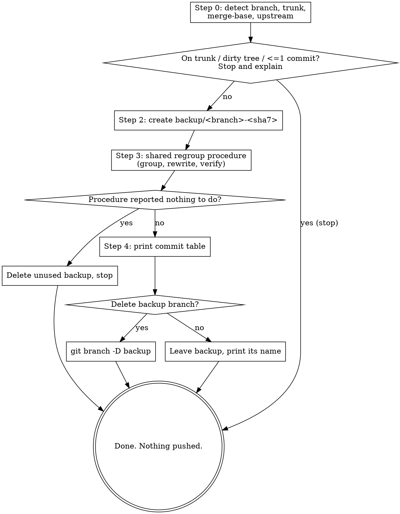

# /cleanup-branch - regroup a branch's history for review

Repackage the commits the current feature branch adds on top of the trunk into a
**smaller set of logically grouped, reviewable commits**, without changing the
resulting code at all. This is pure history repackaging: the files on disk after
cleanup are identical, byte for byte, to before. A reviewer reads one coherent
commit per concern instead of a long trail of small or fixup-style edits.

## Non-negotiable guardrails (safety invariants)

These are not optional. If any cannot be satisfied, stop and report rather than
proceed.

- **Back up before touching anything.** Create a backup branch pointing at the
  current HEAD _before_ the first rewrite. Everything stays recoverable with a
  single `git reset --hard <backup>`.
- **The tree must end up byte-for-byte identical.** This is enforced by the shared
  regroup procedure (its Step 4): if `git diff <backup> HEAD` is not empty, it
  restores from the backup and aborts. Never leave the branch in a changed state.
- **Local only. Never push, never merge.** This skill rewrites local history.
  Updating a remote is the user's call afterward.
- **Refuse on a dirty working tree.** The byte-identical guarantee reasons only
  about committed history, so uncommitted changes are a hard stop (see Step 1).

## What this skill is not

- **Not a squash to one commit.** The goal is a _handful_ of commits split by
  area, not a single combined commit.
- **No fetch, rebase, or push.** It does not sync the branch onto the latest
  trunk and does not push or open anything. It only repackages the commits
  already on the branch.
- **Not a refactor.** It changes _how the work is committed_, never the work.

## Workflow



### Step 0 — Detect the situation

```bash
git branch --show-current                                         # the branch to clean up
git rev-parse --verify main >/dev/null 2>&1 && echo main || echo master   # trunk fallback
gh repo view --json defaultBranchRef -q .defaultBranchRef.name 2>/dev/null # authoritative trunk, if a remote exists
git rev-parse --abbrev-ref --symbolic-full-name '@{u}' 2>/dev/null         # upstream, if the branch was pushed
```

Establish:

- **Trunk name**: prefer the default branch reported by `gh`; fall back to `main`,
  then `master`.
- **Merge-base**: `git merge-base <trunk> HEAD` — the commit this branch forked
  from. **This is the regroup base, not the trunk tip.** Regrouping on top of the
  merge-base preserves the branch's tree even when the branch was never rebased
  onto the latest trunk; using the trunk tip would not.
- **Upstream**: whether the branch already has a remote-tracking counterpart.
  Record it for the closing note (Step 4).

### Step 1 — Refuse early

Stop, change nothing, and explain if any of these hold:

- **On the trunk itself** (current branch is `main`/`master`). There is no feature
  history to regroup.
- **Dirty working tree** (`git status --porcelain` prints anything). Tell the user
  to commit or stash first, then re-run. Do not stash or commit on their behalf.
- **One commit or fewer beyond the trunk**
  (`git rev-list --count <merge-base>..HEAD` ≤ 1). Nothing to regroup.

### Step 2 — Create the backup branch

Before any rewrite, snapshot the current tip so the whole operation is reversible:

```bash
sha7=$(git rev-parse --short HEAD)
safe=$(git branch --show-current | tr '/' '-')   # slashes would create nested refs
git branch "backup/${safe}-${sha7}"
```

If that backup name already exists (a prior cleanup on the same tip), stop and ask
the user to remove the stale backup first rather than overwriting it.

### Step 3 — Regroup (shared procedure)

**Read `../shared/regroup-history.md`** (relative to this skill's base directory)
and perform every step in it, with:

- **`<base>`** = the **merge-base** from Step 0 (`git merge-base <trunk> HEAD`).
- **`<original-tip>`** = the **backup branch** created in Step 2.

The shared procedure decides whether regrouping helps, groups the commits,
rebuilds the history, and verifies the tree is byte-for-byte identical (restoring
from the backup if anything drifted). Return here when it is done.

- **If it reported "nothing to do"** (the history already reads cleanly), there is
  no value in the backup you created — delete it (`git branch -D backup/...`) and
  stop, telling the user the branch was already tidy.
- **If it rebuilt the history**, continue to Step 4.

### Step 4 — Report and offer to delete the backup

Print the new history as a table (`<trunk>..HEAD`), one row per regrouped commit:

```
New history on <branch> (<old-count> → <new-count> commits):

  #  Commit                                       Files  +/-
  1  refactor(rules): extract shared matcher          3  +88 / -40
  2  feat(rules): add conditions operator             4  +120 / -6

Backup saved at backup/<branch>-<sha7>.
```

Source the columns from `git log --oneline <trunk>..HEAD` and
`git show --stat` per commit. Then ask whether to delete the backup:

- **Delete** → `git branch -D backup/<branch>-<sha7>`, confirm it is gone.
- **Keep** → leave it and print its name so the user can delete it later with
  `git branch -D <name>`.

**If the branch has an upstream** (Step 0), add a closing note: the local history
was rewritten, so updating the remote will require a force push
(`git push --force-with-lease`). The `enforce_branch_protection` hook blocks force
pushes for the agent by design, so the user runs that themselves if they want it.

## Common failure modes

| Symptom | Cause | Do this |
| ------- | ----- | ------- |
| Refuses immediately | Dirty tree, on trunk, or ≤1 commit beyond trunk | Commit/stash, switch to a feature branch, or accept there's nothing to regroup |
| Regroup verify failed and rolled back | A group's paths were staged wrong, dropping or altering content | The branch is unchanged; re-read the diff and regroup again |
| A `git commit` is blocked | Subject isn't a valid conventional commit | Fix the subject; `chore` is not an allowed type here |
| Backup name already exists | A prior cleanup left a backup on the same tip | Remove the stale backup, then re-run |
| User wants the remote updated | History was rewritten locally | They run `git push --force-with-lease`; the agent cannot (hook blocks it) |
