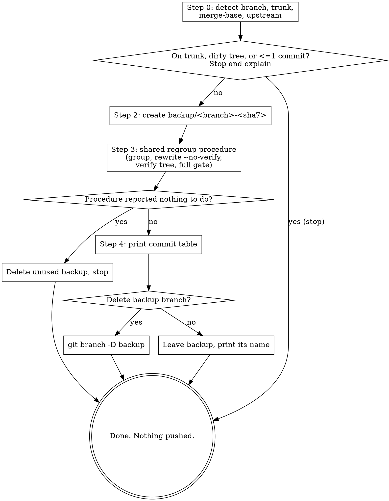

# /cleanup-branch

Repackage the commits that the current feature branch adds on top of the trunk
into a smaller set of logically grouped, reviewable commits. The files on disk
end up byte-for-byte identical. Only the commit boundaries change.

## Guardrails

- Create a backup branch at the current HEAD before the first rewrite. One
  `git reset --hard <backup>` restores everything.
- The tree must end up byte-for-byte identical. The shared regroup procedure
  enforces this and restores from the backup if anything drifted.
- Local only. Never push and never merge. Updating a remote is the user's call.
- Refuse on a dirty working tree. The byte-identical guarantee covers committed
  history only.

This skill is not a squash to one commit, and it never fetches, rebases, or
pushes. It changes how the work is committed, never the work.

## Workflow


```dot
digraph cleanup_branch {
  rankdir=TB; node [shape=box];
  detect   [label="Step 0: detect branch, trunk,\nmerge-base, upstream"];
  refuse   [label="On trunk, dirty tree, or <=1 commit?\nStop and explain" shape=diamond];
  backup   [label="Step 2: create backup/<branch>-<sha7>"];
  regroup  [label="Step 3: shared regroup procedure\n(group, rewrite --no-verify,\nverify tree, full gate)"];
  tidy     [label="Procedure reported nothing to do?" shape=diamond];
  cleanup  [label="Delete unused backup, stop"];
  report   [label="Step 4: print commit table"];
  ask      [label="Delete backup branch?" shape=diamond];
  del      [label="git branch -D backup"];
  keep     [label="Leave backup, print its name"];
  done     [label="Done. Nothing pushed." shape=doublecircle];

  detect -> refuse;
  refuse -> done [label="yes (stop)"];
  refuse -> backup [label="no"];
  backup -> regroup -> tidy;
  tidy -> cleanup [label="yes"];
  cleanup -> done;
  tidy -> report [label="no"];
  report -> ask;
  ask -> del [label="yes"];
  ask -> keep [label="no"];
  del -> done;
  keep -> done;
}
```

### Step 0: Detect the situation

```bash
git branch --show-current                                                  # the branch to clean up
gh repo view --json defaultBranchRef -q .defaultBranchRef.name 2>/dev/null # trunk, if a remote exists
git rev-parse --verify main >/dev/null 2>&1 && echo main || echo master    # trunk fallback
git rev-parse --abbrev-ref --symbolic-full-name '@{u}' 2>/dev/null         # upstream, if pushed
```

- Trunk name: the default branch that `gh` reports, else `main`, else
  `master`.
- Merge-base: `git merge-base <trunk> HEAD`, the commit this branch forked
  from. This is the regroup base, not the trunk tip. Regrouping on the
  merge-base preserves the tree even when the branch was never rebased onto
  the latest trunk.
- Upstream: whether the branch has a remote-tracking counterpart. Step 4 uses
  it for the closing note.

### Step 1: Refuse early

Stop, change nothing, and explain if any of these hold:

- The current branch is the trunk.
- `git status --porcelain` prints anything. Tell the user to commit or stash
  first. Do not stash or commit on their behalf.
- `git rev-list --count <merge-base>..HEAD` is 1 or less. There is nothing to
  regroup.

### Step 2: Create the backup branch

```bash
sha7=$(git rev-parse --short HEAD)
safe=$(git branch --show-current | tr '/' '-')   # a slash would nest the ref
git branch "backup/${safe}-${sha7}"
```

If that name already exists, a prior cleanup ran on the same tip. Stop and ask
the user to remove the stale backup rather than overwrite it.

### Step 3: Regroup

Read `../shared/regroup-history.md` (relative to this skill's base directory)
and do every step in it, with:

- `<base>` = the merge-base from Step 0
- `<original-tip>` = the backup branch from Step 2

The procedure decides whether regrouping helps, groups the commits, and
rebuilds the history. It proves the tree is byte-for-byte identical and runs
the project's full gate once at the end. Then:

- If it reported nothing to do, delete the backup (`git branch -D backup/...`)
  and stop. Tell the user the branch was already tidy.
- If its closing gate is red, the regrouped history is still sound and the
  failures predate the cleanup. Report them, keep the backup, skip the delete
  offer in Step 4, and let the user decide. Do not fix the failures yourself.
- If it rebuilt the history and the gate is green, continue to Step 4.

### Step 4: Report and offer to delete the backup

Print the new history as a table, one row per commit in `<trunk>..HEAD`.
Source the columns from `git log --oneline` and `git show --stat`:

```text
New history on <branch> (<old-count> -> <new-count> commits):

  #  Commit                                       Files  +/-
  1  refactor(rules): extract shared matcher          3  +88 / -40
  2  feat(rules): add conditions operator             4  +120 / -6

Backup saved at backup/<branch>-<sha7>.
```

Then ask whether to delete the backup:

- Delete: `git branch -D backup/<branch>-<sha7>`, and confirm that it is gone.
- Keep: print its name so the user can delete it later.

If the branch has an upstream, add a closing note: the local history was
rewritten, so updating the remote needs `git push --force-with-lease`. The
`enforce_branch_protection` hook blocks force pushes for the agent, so the user
runs that themselves.

## Failure modes

| Symptom                                           | Cause                                             | Do this                                                                               |
| ------------------------------------------------- | ------------------------------------------------- | ------------------------------------------------------------------------------------- |
| Refuses immediately                               | Dirty tree, on trunk, or 1 commit or less         | Commit or stash, switch to a feature branch, or accept there is nothing to regroup    |
| Regroup verify failed and rolled back             | A group's paths were staged wrong                 | The branch is unchanged. Re-read the diff and regroup again                           |
| A `git commit` is blocked                         | Subject is not a valid conventional commit        | Fix the subject. `chore` is not allowed, and `--no-verify` does not bypass this gate   |
| A `pre-commit` hook fails or reformats a commit   | A group commit staged only part of the tree       | Commit each group with `--no-verify`. The full gate runs once at the end              |
| The closing gate is red                           | Pre-existing breakage. The tree is unchanged      | Report it, keep the backup, do not fix it here                                        |
| Backup name already exists                        | A prior cleanup left a backup on the same tip     | Remove the stale backup, then re-run                                                  |
| User wants the remote updated                     | History was rewritten locally                     | They run `git push --force-with-lease`. The hook blocks the agent from doing it       |
