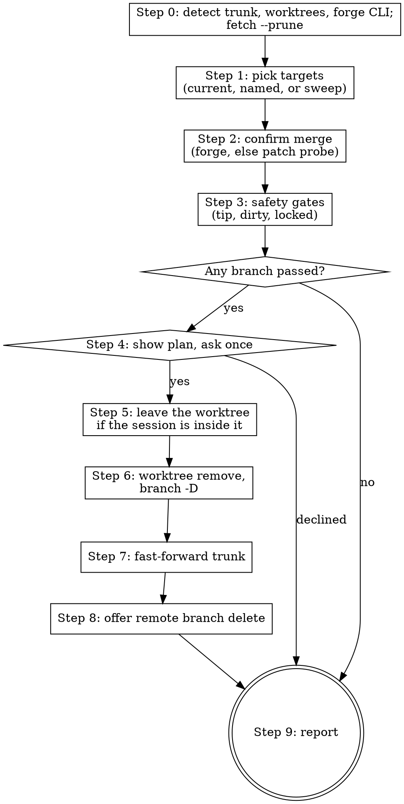

# Cleanup branch

Clean up after a PR merged on the remote: remove the branch's worktree, delete
the local branch, and fast-forward the local trunk.

A squash or rebase merge leaves no ancestry between the branch and the trunk,
so `git branch -d` always refuses with "not fully merged" and the delete has to
be `git branch -D`. That turns off git's own safety net. This skill replaces
it with two checks: proof that the branch merged, and proof that the local
branch holds nothing the merge left out.

## Guardrails

- Delete a branch only when Step 2 confirms the merge and Step 3 passes. Never
  act on a guess, and never on an upstream marked `[gone]` alone. That only
  means the remote branch was deleted, not that it merged.
- Never force anything: no `git worktree remove --force`, no stash, no
  `reset`, no `pull` that can create a merge commit.
- The trunk moves only by fast-forward.
- Never push, except deleting the remote branch in Step 8, and only when the
  user says yes to that specific question.
- Show the plan and get one confirmation before Step 5 deletes anything.

## Workflow


```dot
digraph cleanup_branch {
  rankdir=TB; node [shape=box];
  detect   [label="Step 0: detect trunk, worktrees, forge CLI;\nfetch --prune"];
  targets  [label="Step 1: pick targets\n(current, named, or sweep)"];
  merged   [label="Step 2: confirm merge\n(forge, else patch probe)"];
  gates    [label="Step 3: safety gates\n(tip, dirty, locked)"];
  any      [label="Any branch passed?" shape=diamond];
  confirm  [label="Step 4: show plan, ask once" shape=diamond];
  leave    [label="Step 5: leave the worktree\nif the session is inside it"];
  clean    [label="Step 6: worktree remove,\nbranch -D"];
  trunk    [label="Step 7: fast-forward trunk"];
  remote   [label="Step 8: offer remote branch delete"];
  done     [label="Step 9: report" shape=doublecircle];

  detect -> targets -> merged -> gates -> any;
  any -> done [label="no"];
  any -> confirm [label="yes"];
  confirm -> done [label="declined"];
  confirm -> leave [label="yes"];
  leave -> clean -> trunk -> remote -> done;
}
```

### Step 0: Detect the situation

```bash
git symbolic-ref --short refs/remotes/origin/HEAD   # origin/main: the trunk
git worktree list --porcelain                       # every checkout, its branch, locked flag
git remote get-url origin                           # the forge host
git fetch --prune origin
```

- Strip `origin/` from the trunk ref. If the command fails, run
  `git remote set-head origin --auto` and read it again.
- If there is no `origin` remote, stop. Without a remote there is nothing to
  have merged into.
- From the worktree list, note which checkout holds the trunk, which holds each
  branch, and which is the main checkout (the first entry). Note whether the
  session's cwd is inside a linked worktree (`git rev-parse --show-toplevel`).
- Pick the forge CLI from the host, and check that it is authenticated:

| Host                                          | CLI    | Auth check         |
| --------------------------------------------- | ------ | ------------------ |
| github.com or GitHub Enterprise               | `gh`   | `gh auth status`   |
| Gitea or Forgejo                              | `tea`  | `tea login list`   |
| gitlab.com or self-hosted GitLab              | `glab` | `glab auth status` |
| Self-hosted host you cannot identify by name  | the CLI whose logins include the host | |
| Local path or `file://` URL (no network host) | none   | use the fallback   |

A missing or unauthenticated CLI is not a stop. It sends every branch to the
fallback check in Step 2, which is stricter. Say so in the report.

### Step 1: Pick the targets

- **A named branch**, when the user names one.
- **The current branch**, when it is not the trunk.
- **Sweep**, when the user asks to clean up all merged branches, or the
  current branch is the trunk and no branch was named. Every local branch
  except the trunk is a target:

  ```bash
  git for-each-ref --format='%(refname:short)' refs/heads
  ```

Never target the trunk itself.

### Step 2: Confirm the merge

Check the forge first. Git alone cannot tell a squash merge from an abandoned
branch; the forge knows.

- **GitHub:**

  ```bash
  gh pr list --head <branch> --state merged --json number,url,headRefOid,isCrossRepository \
    --jq '[.[] | select(.isCrossRepository | not)][0]'
  ```

  Number `.number`, URL `.url`, head SHA `.headRefOid`. `--head` cannot name
  the fork owner, so the filter drops fork PRs that share the branch name.
- **Gitea / Forgejo:** `tea pulls list` has no merged state, no head filter,
  and no head SHA field, so go through the API (tea fills in `{owner}` and
  `{repo}`):

  ```bash
  tea api 'repos/{owner}/{repo}/pulls?state=closed&sort=recentclose&limit=50' \
    | jq '[.[] | select(.merged and .head.label == "<branch>"
                        and .head.repo_id == .base.repo_id)][0]'
  ```

  Number `.number`, URL `.html_url`, head SHA `.head.sha`. Match on
  `.head.label`: once the head branch is deleted, Gitea rewrites `.head.ref`
  to `refs/pull/<n>/head`. A branch merged long ago may fall outside the 50
  most recent; page with `&page=2` before calling it unmerged.
- **GitLab:**

  ```bash
  glab mr list --merged --source-branch <branch> --output json
  ```

  Number `.iid`, URL `.web_url`, head SHA `.sha`. (`-o` is `--order` in
  glab, not output.)

Empty output or `null` means the forge has no merged PR for the branch.
Query merged PRs by head branch, not "the PR for this branch". A branch name
reused for a newer, still-open PR would otherwise hide the merged one. If
several merged PRs match, use the most recent.

A merged PR is the verdict. Record its number, URL, and head SHA as
`<merged-head>` for Step 3.

When there is no usable forge CLI, or the forge has no merged PR for the
branch (for example, the branch was squash-merged by hand), fall back to git:

```bash
git merge-base --is-ancestor <branch> origin/<trunk>   # exit 0: merged with ancestry
```

If that fails, check for a squash: build a throwaway commit holding the
branch's whole diff, and ask whether an equivalent patch is on the trunk.

```bash
mb=$(git merge-base origin/<trunk> <branch>)
probe=$(git commit-tree "<branch>^{tree}" -p "$mb" -m probe)
git cherry origin/<trunk> "$probe"    # "- <sha>": an equivalent patch is on the trunk
```

The probe commit is unreferenced and git garbage-collects it. A `+` means no
equivalent patch landed. That happens when the branch is unmerged, when the
merged PR held only part of the branch, or when conflict resolution changed
the patch. All three are "not confirmed": leave the branch.

When the probe prints `+` and `origin/<branch>` still exists, probe
`origin/<branch>` the same way. A `-` there means the pushed branch merged and
the local branch has commits on top of it. Report it as "merged, N local
commits not in it" and list them (`git log --oneline origin/<branch>..<branch>`),
so the user sees what kept it from being cleaned up.

Mark each verdict with its evidence: `PR #<n>`, `ancestor of trunk`, or
`patch-equivalent on trunk`.

### Step 3: Safety gates

Run these on the branches Step 2 confirmed; the rest are already skipped.
Refuse a branch, changing nothing for it, when any of these hold:

- **Tip gate (forge verdict only).** The local branch must hold no commit the
  merged PR lacked. It passes when the local tip equals `<merged-head>`, or is
  an ancestor of it (commits pushed to the PR on the remote, such as applied
  review suggestions, are fine). The ancestry check needs `<merged-head>`
  locally:

  ```bash
  git cat-file -e "<merged-head>^{commit}" 2>/dev/null \
    || git fetch origin <pr-ref>
  git merge-base --is-ancestor <branch> <merged-head>
  ```

  `<pr-ref>` is the forge's read-only ref for the PR head:
  `refs/pull/<n>/head` on GitHub and Gitea/Forgejo, and
  `refs/merge-requests/<iid>/head` on GitLab, which deletes it 14 days after
  the merge. If the object still cannot be fetched, require the local tip to
  equal `<merged-head>` exactly. On a fail, list the extra commits
  (`git log --oneline <merged-head>..<branch>`) so the user sees what would
  have been lost. Those commits were never pushed, or were pushed after the
  merge.

  The fallback verdicts need no tip gate: ancestry and the patch probe both
  cover every commit on the local branch.
- **Dirty worktree.** The checkout holding the branch has any change,
  untracked files included:

  ```bash
  (cd <absolute-checkout-path> && git status --porcelain)
  ```

  Do not stash or commit on the user's behalf. Report the files.
- **Locked worktree.** `git worktree list --porcelain` shows `locked` for its
  checkout. Report it. Unlocking is the user's call.

If no branch passes, report the verdicts and stop.

### Step 4: Show the plan and confirm

One table, every target, before anything is deleted:

```text
Branch                Evidence                    Worktree                       Action
feat/s3-auth          PR #42                      .worktrees/feat-s3-auth        remove worktree, delete branch
fix/timeout           patch-equivalent on trunk   (main checkout)                switch to main, delete branch
fix/typo              ancestor of trunk           -                              delete branch
feat/docs             PR #44                      .worktrees/feat-docs           skip: dirty (?? notes.txt)
feat/wip              no merged PR                .worktrees/feat-wip            skip: not merged
feat/review-fixes     PR #40                      -                              skip: 2 commits not in the PR

Then: fast-forward main to origin/main (3 commits).
```

Count the trunk's incoming commits with
`git rev-list --count <trunk>..origin/<trunk>`. Ask once whether to proceed with the rows that pass. Deleting the remote
branch is a separate question in Step 8, never part of this one.

### Step 5: Leave the worktree first

Removing the directory the session runs in breaks every later shell call. If
the session's cwd is inside a worktree about to be removed:

- If the session entered it with `EnterWorktree`, call `ExitWorktree` with
  `action: "keep"` (Step 6 removes it after the gates).
- Otherwise `cd` to the trunk's checkout in its own Bash call.

### Step 6: Remove the worktree, delete the branch

Per passing branch, from outside the worktree:

```bash
git worktree remove <worktree-path>   # never rm -rf the directory by hand
git branch -D <branch>                # Steps 2-3 are the safety net that -d cannot be
```

If the branch is checked out in the main checkout instead of a linked
worktree, there is no worktree to remove. Switch that checkout to the trunk
first (`git switch <trunk>`), then delete the branch.

Before each delete, record the branch's tip (`git rev-parse --short <branch>`)
for the report. Until garbage collection runs, `git branch <branch> <sha>`
restores it.

If `git worktree remove` refuses, something changed since Step 3. Stop for
that branch and report. Do not force it.

### Step 7: Fast-forward the trunk

- Trunk checked out somewhere: `cd` into that checkout, confirm
  `git status --porcelain` is empty, then:

  ```bash
  git pull --ff-only origin <trunk>
  ```

  If that checkout is dirty, skip the pull and say so.
- Trunk not checked out anywhere: update the ref directly. This refuses
  anything but a fast-forward.

  ```bash
  git fetch origin <trunk>:<trunk>
  ```

If either form reports divergence (the local trunk has commits the remote
lacks), stop and report. Do not rebase, merge, or reset the trunk.

### Step 8: Offer to delete the remote branch

For each branch deleted in Step 6 whose `origin/<branch>` still exists after
the Step 0 prune, ask whether to delete it on the remote. Skipped branches are
not offered. If no deleted branch has a remote branch left, skip this step
without asking.

```bash
git push origin --delete <branch>
```

This changes shared state, so ask about it separately and only proceed on a
clear yes. Mention that the forge's setting to delete head branches
automatically after merge makes this step unnecessary.

### Step 9: Report

```text
Cleaned up:
  feat/s3-auth   PR #42   worktree .worktrees/feat-s3-auth removed   was 3f9c2ab
  fix/timeout    patch-equivalent on trunk                          was 81d0e4c

Skipped:
  feat/docs          dirty worktree (?? notes.txt)
  feat/wip           not merged
  feat/review-fixes  2 commits not in PR #40 (listed above)

main: e31c384 -> 9a1b7f0 (fast-forward, 3 commits).
Remote branches: none left to delete.
Merge evidence: forge (gh).
Nothing pushed.
```

On the "Merge evidence" line, name the fallback when it was used ("git
ancestry and patch equivalence; no forge CLI for this remote"). On the
"Remote branches" line, list the remote branches deleted or kept in Step 8.

## Failure modes

| Symptom                                         | Cause                                                       | Do this                                                                 |
| ----------------------------------------------- | ----------------------------------------------------------- | ----------------------------------------------------------------------- |
| `git branch -d` says "not fully merged"         | Squash or rebase merge left no ancestry                     | Expected. Use `-D` once Steps 2 and 3 pass                              |
| Forge says merged, tip gate fails               | Local commits never pushed, or pushed after the merge       | Skip the branch. Show the extra commits. The user decides               |
| Patch probe prints `+`                          | Unmerged, partially merged, or conflict-resolved squash     | Not confirmed. Skip the branch                                          |
| Upstream shows `[gone]` but nothing confirms    | Remote branch deleted without a merge                       | Skip the branch. Report it as "upstream gone, merge unconfirmed"        |
| Every shell call fails after cleanup            | The session's cwd was removed                               | Step 5 prevents this. `cd` to the trunk checkout                        |
| `git worktree remove` refuses                   | Dirty, untracked, or locked worktree                        | Stop for that branch. Never `--force`                                   |
| `pull --ff-only` or the ref update refuses      | Local trunk diverged from the remote                        | Stop and report. Never reset the trunk                                  |
| Forge CLI missing or not logged in              | No usable CLI for the host                                  | Use the git fallback for every branch and say so                        |
