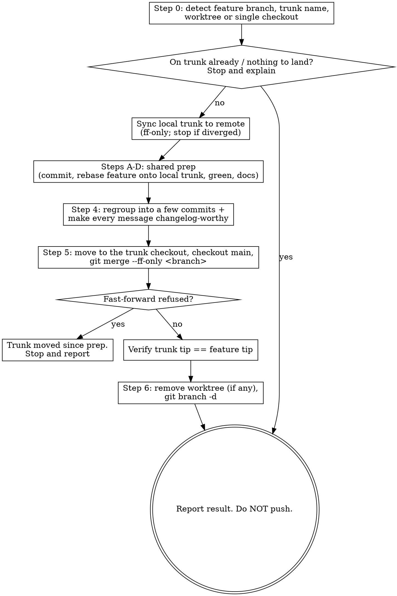

# Fast-forward

Land a completed feature branch (or its worktree) onto the local `main`/`master`
branch as a **fast-forward** of its commits, then clean up. Unlike collapsing the
branch to a single commit, this keeps the branch's handful of logically grouped
commits and welds them, unchanged, onto the trunk — no merge commit, no squash,
linear history.

Because those commits become the trunk's **permanent public history**, this skill
holds every one of them to a changelog-worthy bar before it lands. That per-commit
discipline is the whole reason to reach for `/fast-forward` instead of squashing:
the reader of the trunk log or a release changelog sees the real shape of the work,
so each commit must read as an entry they'd want there.

This skill is **destructive and irreversible** once the deletions run, and it
**never pushes** — the fast-forward lands on the _local_ trunk only.

## Non-negotiable guardrails

- **Never push.** The fast-forward lands on the _local_ trunk. Stop after cleanup
  and let the user push when they're ready.
- **Fast-forward only — never a merge commit.** Use `git merge --ff-only`. If it
  refuses, the trunk moved since the prep rebase; **stop and report**. Do not fall
  back to a `--no-ff` merge: a merge commit defeats the linear history this skill
  exists to produce, and silently changes what lands on the trunk.
- **Every landing commit is changelog-worthy.** The commits become permanent
  public history, so each subject and body must read as a release note for a
  _user_ of the project: what changed and why they benefit. No inside baseball —
  private class/file/module names as the _point_ of the message, incidental churn
  (lint, test tweaks, renames) dressed up as a feature, or process references
  ("as discussed", "addresses review", agent/tool/conversation mentions, bare
  ticket or PR numbers). See Step 4 for the bar and how it's enforced.
- **Verify before you delete.** Confirm the trunk fast-forwarded and holds the
  work _before_ removing any branch or worktree. Deletions are the last steps.
- **Conventional commits throughout.** Every commit this skill makes — prep
  commits and the regrouped commits — must be a valid conventional commit (full
  rule in the shared prep reference). The `enforce_commit_message` hook rejects
  anything else.

## Why this works with branch protection

This repo's `enforce_branch_protection` hook blocks commits and file edits on
`main`/`master`. `/fast-forward` never trips it, for two reasons:

- **All commits land on the feature branch, never the trunk.** The prep, the
  regroup, and any message rewrites all run while the branch is checked out, where
  commits are allowed. The trunk is only touched by the fast-forward itself.
- **A fast-forward merge makes no commit.** `git merge --ff-only <branch>` just
  advances the trunk ref; it cannot write a merge commit, so the hook permits it.
  (The hook _does_ block merges that would land a merge commit on the trunk — a
  bare `git merge` or `--no-ff` — so the `--ff-only` here is also what keeps the
  merge itself allowed, not only what guarantees linear history.) No squash
  carve-out is needed, unlike collapsing to a single commit, which _does_ commit
  on the trunk.

## Workflow



### Step 0 — Detect the situation

Establish four facts before touching anything:

```bash
git branch --show-current                 # the feature branch to land
git rev-parse --git-dir                    # differs from below inside a worktree
git rev-parse --git-common-dir             # points at the real .git
git worktree list                          # shows every checkout + its branch
```

- **Trunk name**: prefer `main`; use `master` if that's what exists
  (`git rev-parse --verify main` / `master`).
- **Worktree vs single checkout**: if `--git-dir` and `--git-common-dir` resolve
  to different paths, you are in a _linked worktree_; the trunk lives in a separate
  checkout (find it in `git worktree list` — it's the one on `main`/`master`).
  Otherwise it's a single checkout and you'll switch it to the trunk yourself.

**Refuse early** if either:

- the current branch is already `main`/`master` (nothing to land), or
- the branch has no commits beyond the trunk **and** the working tree is clean
  (truly nothing to land).

A branch level with the trunk but with _uncommitted_ changes is **not** a refusal:
the shared prep's first step commits that work onto the branch, leaving something
to land. Run `git status --porcelain` before refusing on the second condition — if
it prints anything, there is work to land, so proceed.

### Sync the local trunk first

The fast-forward lands on the **local** trunk (Step 5), which can be _ahead_ of
its remote (prior unpushed landings) or, if the remote advanced, _behind_ it. Bring
the local trunk current with the remote **before** the shared prep rebases the
feature onto it, so the feature is built on exactly what it will land on and any
conflict surfaces during prep, not mid-merge. Skip this whole step on a local-only
repo (no remote).

```bash
git fetch --all --prune
```

Fast-forward the local trunk to the remote without rewinding a locally-ahead trunk
or forcing a divergence. The mechanics differ by the layout detected in Step 0:

- **Single checkout** (you're on the feature branch; the trunk isn't checked out,
  and the tree may still be dirty — Step A hasn't run yet). Update the trunk ref
  only when the remote is strictly ahead:

  ```bash
  ahead=$(git rev-list --count origin/<trunk>..<trunk>)    # local-only commits
  behind=$(git rev-list --count <trunk>..origin/<trunk>)   # remote-only commits
  if [ "$behind" -gt 0 ] && [ "$ahead" -eq 0 ]; then
      git fetch . origin/<trunk>:<trunk>   # remote strictly ahead → fast-forward local trunk
  elif [ "$behind" -gt 0 ]; then
      : # diverged (both sides have unique commits) → STOP and report; never force
  fi
  # ahead-only or equal → nothing to do; the local trunk already contains the remote
  ```

- **Worktree** (the trunk is checked out in another worktree from Step 0).
  Fast-forward it in place:

  ```bash
  git -C <trunk-checkout> merge --ff-only origin/<trunk>   # ahead → no-op; behind → ff; diverged → fails, STOP
  ```

If either form reports divergence, **stop and report** — do not force it.

### Steps A–D — Prepare the branch (shared)

**Read `../shared/finishing-prep.md`** (relative to this skill's base directory)
and perform every step in it before continuing. Every commit it makes goes onto
the _feature branch_, never the trunk. The fast-forward lands on the **local**
trunk you just synced, so that prep's Step B rebases onto it:

- **`<rebase-onto>`** = the **local** `<trunk>` branch (not `origin/<trunk>`) — the
  exact commit the fast-forward will land on. Rebasing the feature onto it is what
  makes the branch a linear descendant of the trunk, which is what _guarantees_ a
  true fast-forward is possible in Step 5.

Return here once it's done.

### Step 4 — Regroup into changelog-worthy commits

Repackage the branch into a few logically grouped commits **and** make every one of
them read as a public changelog entry. These commits land verbatim on the trunk, so
this is the step that earns the linear history.

Record the current tip first so the rewrite is verifiable:

```bash
orig=$(git rev-parse HEAD)   # tip before any rewrite, for the byte-identical check
```

**Read `../shared/regroup-history.md`** (relative to this skill's base directory)
and perform every step in it, with:

- **`<base>`** = the **local** `<trunk>` branch (the commit you rebased onto in
  Step B, and the one the fast-forward lands on).
- **`<original-tip>`** = `$orig` (the SHA recorded just above).

That procedure groups the commits, rebuilds them with a soft reset, and verifies the
tree is byte-for-byte identical (restoring from `$orig` if anything drifted). Apply
two `/fast-forward`-specific augmentations to it:

1. **Widen its "is a rewrite worth it?" test to include message quality.** The
   procedure normally leaves a branch alone when the _grouping_ already reads
   cleanly. Here, also rewrite when any existing subject or body fails the
   changelog bar below — a branch with perfect grouping but inside-baseball
   messages still needs the rewrite to fix the wording. The rewrite stays
   tree-preserving either way (its byte-identical guard is unchanged); only the
   commit messages improve.
2. **Hold every subject and body you write to the changelog bar.** A commit is
   changelog-worthy when a _user_ of the project, reading the trunk log or a
   release changelog, learns what changed and why it benefits them:

   - **Describe the user-facing change**, not the internal mechanics. Reference the
     public capability or behavior, not private class/function/module names or file
     paths — unless that name _is_ the public surface (a CLI flag, an exported API).
   - **No process or provenance references**: "as discussed", "per review",
     "addresses feedback", mentions of agents/tools/conversations/sessions, or bare
     ticket/PR numbers as the message's payload. None of that means anything to a
     changelog reader.
   - **Don't dress incidental churn as a feature.** Fold lint fixes, test tweaks,
     and renames into the commit they support, or word them honestly — unless the
     churn _is_ the user-facing point.
   - Still a valid conventional commit (`<type>(<scope>): <subject>`), since the
     `enforce_commit_message` hook enforces that on each commit.

Return here once the procedure reports the tree is verified unchanged. If it rolled
back (the byte-identical check failed), the branch is exactly as it was — re-read
the diff and regroup again before continuing; do not fast-forward a branch the
rewrite could not faithfully rebuild.

### Step 5 — Fast-forward onto the trunk

Get onto the trunk checkout, then fast-forward it to the feature branch.

- **Single checkout**: `git checkout <trunk>` in the current repo.
- **Worktree**: `cd` into the trunk's checkout (from `git worktree list`); it's
  already on the trunk. Confirm with `git status` that the trunk tree is clean
  before merging — a dirty trunk means stop and ask the user.

The local trunk was fast-forwarded to the remote in the sync step, and the shared
prep (Step B) rebased the feature onto that up-to-date local trunk — so the feature
now sits directly on the commit it's about to land on. On a remote-backed repo,
re-confirm the trunk is still current as a cheap safety net before merging (skip on
a local-only repo):

```bash
git merge --ff-only origin/<trunk>    # expected: "Already up to date" (synced in prep)
```

If this unexpectedly reports the trunk is behind or diverged, the remote moved since
prep — **stop and report** rather than forcing it, then restart from the sync step.

Now fast-forward the trunk to the feature branch:

```bash
git merge --ff-only <feature-branch>
```

- **Success** stages no conflict and creates no commit: the trunk ref simply
  advances to the feature tip, bringing the regrouped commits with it.
- **If `--ff-only` refuses** ("Not possible to fast-forward"), the trunk is no
  longer an ancestor of the feature — the remote or local trunk moved since the
  Step B rebase. **Stop and report.** Do not retry with `--no-ff`; restart from the
  sync step so the feature is rebased onto the current trunk first.

### Step 6 — Verify, then clean up

Only after the fast-forward, and only once verified.

Confirm the trunk now points at the work:

```bash
git log -1 --stat                       # the feature's tip commit is now the trunk tip
git rev-parse HEAD <feature-branch>     # both SHAs identical → fast-forward landed
```

Then remove the leftovers. A fast-forward makes the feature branch a true ancestor
of the trunk, so `git branch -d` (safe delete) **succeeds and doubles as a final
merge check** — if it ever complained "not fully merged", the merge did not actually
land and you should stop rather than force it. (This is the opposite of a squash
landing, which records no merge ancestry and needs `-D`.)

Order matters: a branch checked out in a worktree can't be deleted, so remove the
worktree first.

```bash
# Worktree case only — frees the branch. Never rm -rf the directory by hand;
# let git remove it so its metadata is cleaned up too.
git worktree remove <worktree-path>

# Both cases — safe delete; it confirms the branch is fully merged.
git branch -d <feature-branch>
```

If `git worktree remove` complains about untracked or dirty files, **stop and
report** rather than forcing — forcing would silently discard those files.

### Finish

Summarize what happened: the commits now on the local trunk (hashes + subjects,
from `git log <old-trunk-tip>..HEAD --oneline`), the branch deleted, the worktree
removed. Remind the user the trunk is **not pushed** — that's theirs to do.

## Common failure modes

| Symptom                              | Cause                                                | Do this                                                                            |
| ------------------------------------ | ---------------------------------------------------- | --------------------------------------------------------------------------------- |
| `--ff-only` refuses                  | Trunk moved since the prep rebase; branch no longer linear | Stop; restart from the sync step so the feature rebases onto the current trunk. Never `--no-ff` |
| Local trunk sync reports divergence  | Local and remote trunk both have unique commits      | Stop and report; never force the trunk to either side                             |
| Regroup verify failed and rolled back | A group's paths were staged wrong, dropping/altering content | The branch is unchanged; re-read the diff and regroup again before landing        |
| Commit rejected by hook              | A regrouped/prep message isn't a valid conventional commit | Fix the type/subject; `chore` is not an allowed type here                          |
| Messages read like internal notes    | Commits carry inside baseball, not changelog entries | Rewrite them in Step 4 (the regroup rewrite is tree-preserving); land only worthy messages |
| `branch -d` says "not fully merged"  | The fast-forward did not actually land               | Stop — do not `-D`; investigate why the trunk tip isn't the feature tip           |
| `worktree remove` refuses            | Untracked/dirty files in the worktree                | Stop, show the user; don't force-discard their files                              |
| Merge conflict during prep rebase    | Trunk diverged from the branch's base                | Stop; let the user resolve, then resume (handled in the shared prep)              |
