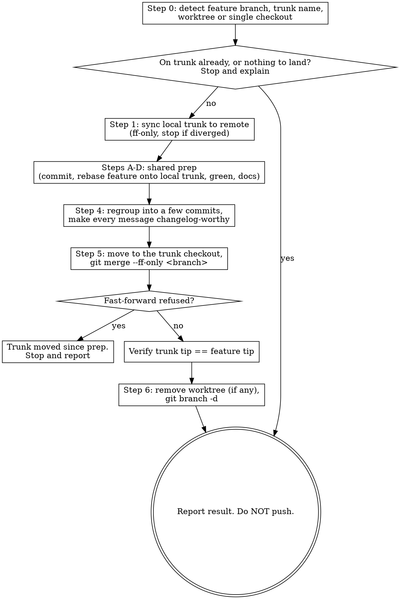

# Fast-forward

Land a completed feature branch (or its worktree) onto the local `main` or
`master` branch as a fast-forward of its commits, then clean up. The branch's
commits move onto the trunk unchanged, with no merge commit and no squash. Those
commits become the trunk's permanent public history, so every one of them must
read as a changelog entry before it lands.

This skill is destructive and irreversible once the deletions run.

## Guardrails

- Never push. The fast-forward lands on the local trunk only. Stop after
  cleanup and let the user push.
- Fast-forward only. Use `git merge --ff-only`. If it refuses, the trunk moved
  since the prep rebase. Stop and report. Never fall back to a `--no-ff`
  merge, because a merge commit defeats the linear history this skill exists
  to produce.
- Every landing commit is changelog-worthy. Step 4 gives the bar.
- Verify before you delete. Confirm that the trunk fast-forwarded and holds the
  work before you remove any branch or worktree.
- Every commit this skill makes must be a valid conventional commit. The
  `enforce_commit_message` hook rejects anything else.

## Why this works with branch protection

The `enforce_branch_protection` hook blocks commits and file edits on `main`
and `master`. This skill never trips it. Every commit lands on the feature
branch while it is checked out. The trunk changes only through
`git merge --ff-only`, which advances the trunk ref and writes no commit. A bare
`git merge` or `--no-ff` writes a merge commit onto the trunk, and the hook
stops that for approval.

## Workflow


```dot
digraph fast_forward {
  rankdir=TB; node [shape=box];
  detect   [label="Step 0: detect feature branch, trunk name,\nworktree or single checkout"];
  refuse   [label="On trunk already, or nothing to land?\nStop and explain" shape=diamond];
  sync     [label="Step 1: sync local trunk to remote\n(ff-only, stop if diverged)"];
  prep     [label="Steps A-D: shared prep\n(commit, rebase feature onto local trunk, green, docs)"];
  regroup  [label="Step 4: regroup into a few commits,\nmake every message changelog-worthy"];
  goto     [label="Step 5: move to the trunk checkout,\ngit merge --ff-only <branch>"];
  fffail   [label="Fast-forward refused?" shape=diamond];
  stop     [label="Trunk moved since prep.\nStop and report"];
  verify   [label="Verify trunk tip == feature tip"];
  cleanup  [label="Step 6: remove worktree (if any),\ngit branch -d"];
  done     [label="Report result. Do NOT push." shape=doublecircle];

  detect -> refuse;
  refuse -> done [label="yes"];
  refuse -> sync [label="no"];
  sync -> prep -> regroup -> goto -> fffail;
  fffail -> stop [label="yes"];
  fffail -> verify [label="no"];
  verify -> cleanup -> done;
}
```

### Step 0: Detect the situation

```bash
git branch --show-current       # the feature branch to land
git rev-parse --git-dir         # differs from the next line inside a worktree
git rev-parse --git-common-dir  # points at the real .git
git worktree list               # every checkout and its branch
```

- Trunk name: `main`, or `master` when that is the branch that exists
  (`git rev-parse --verify main`).
- Layout: when `--git-dir` and `--git-common-dir` resolve to different paths,
  you are in a linked worktree, and the trunk lives in a separate checkout.
  Find it in `git worktree list`. It is the checkout on the trunk. If no
  checkout is on the trunk, stop and report. Otherwise this is a single
  checkout, and you switch it to the trunk yourself in Step 5.

Stop and explain if the current branch is the trunk. Also stop if the branch
has no commits beyond the trunk and `git status --porcelain` prints nothing.
A branch level with the trunk but with uncommitted changes is not a refusal.
The shared prep commits that work, and one commit then remains to land.

### Step 1: Sync the local trunk

The fast-forward lands on the local trunk, which can be ahead of its remote
(prior unpushed landings) or behind it. Bring the local trunk current before
the prep rebases the feature onto it, so any conflict surfaces during prep.
Skip this step on a local-only repo.

```bash
git fetch --all --prune
```

Then fast-forward the local trunk without rewinding a locally-ahead trunk. The
mechanics depend on the layout from Step 0.

- Single checkout. The trunk is not checked out, and the tree can still be
  dirty. Update the trunk ref only when the remote is strictly ahead:

  ```bash
  ahead=$(git rev-list --count origin/<trunk>..<trunk>)    # local-only commits
  behind=$(git rev-list --count <trunk>..origin/<trunk>)   # remote-only commits
  if [ "$behind" -gt 0 ] && [ "$ahead" -gt 0 ]; then
      echo "DIVERGED: both sides have unique commits"      # STOP and report, never force
  elif [ "$behind" -gt 0 ]; then
      git fetch . origin/<trunk>:<trunk>                   # remote strictly ahead: fast-forward
  fi
  # ahead-only or equal: nothing to do
  ```

- Worktree. The trunk is checked out in the other worktree. Fast-forward it in
  place:

  ```bash
  git -C <trunk-checkout> merge --ff-only origin/<trunk>   # diverged: fails, so stop
  ```

If either form reports divergence, stop and report. Never force it.

### Steps A to D: Prepare the branch

Read `../shared/finishing-prep.md` (relative to this skill's base directory) and
do every step in it. Every commit it makes goes onto the feature branch. The
fast-forward lands on the local trunk you synced in Step 1, so pass:

- `<rebase-onto>` = the local `<trunk>` branch, not `origin/<trunk>`

Rebasing onto the local trunk makes the feature a linear descendant of the exact
commit it will land on. That is what guarantees a fast-forward in Step 5. Return
here when it is done.

### Step 4: Regroup into changelog-worthy commits

Record the tip, then run the shared regroup procedure:

```bash
orig=$(git rev-parse HEAD)   # tip before any rewrite, for the byte-identical check
```

Read `../shared/regroup-history.md` (relative to this skill's base directory)
and do every step in it, with:

- `<base>` = the local `<trunk>` branch (the commit from Step B)
- `<original-tip>` = `$orig`

The procedure groups the commits, rebuilds them with a soft reset, proves the
tree is byte-for-byte identical, and runs the project's full gate once at the
end. If that gate is red, stop and report. Do not fast-forward. If the
procedure rolled back, the branch is exactly as it was. Re-read the diff and
regroup again before you continue.

This skill adds two rules to the procedure:

1. Rewrite when any message fails the changelog bar, even if the grouping is
   already clean. The rewrite stays tree-preserving. Only the messages change.
2. Hold every subject and body to the changelog bar. Read
   `../shared/commit-subjects.md` (relative to this skill's base directory)
   for it. In addition:
   - Name a private class, function, module, or file path only when it is the
     public surface, such as a CLI flag or an exported API.
   - Do not dress incidental churn as a feature. Fold lint fixes, test tweaks,
     and renames into the commit they support, unless the churn is the
     user-facing point.
   - Keep the conventional-commit form. The `enforce_commit_message` hook
     validates each commit, and `--no-verify` does not bypass it.

### Step 5: Fast-forward onto the trunk

Get onto the trunk checkout:

- Single checkout: `git checkout <trunk>`.
- Worktree: `cd` into the trunk's checkout from `git worktree list`. Run
  `git status` and confirm that the tree is clean. If it is dirty, stop and ask
  the user.

On a remote-backed repo, confirm that the trunk is still current:

```bash
git merge --ff-only origin/<trunk>    # expected: "Already up to date"
```

If this reports that the trunk is behind or diverged, the remote moved since
Step 1. Stop and report, then restart from Step 1.

Now fast-forward the trunk to the feature branch:

```bash
git merge --ff-only <feature-branch>
```

Success creates no commit. The trunk ref advances to the feature tip. If
`--ff-only` refuses ("Not possible to fast-forward"), the trunk moved since the
Step B rebase. Stop and report. Do not retry with `--no-ff`. Restart from Step 1
so the feature rebases onto the current trunk.

### Step 6: Verify, then clean up

Confirm that the trunk points at the work:

```bash
git log -1 --stat                       # the feature tip is now the trunk tip
git rev-parse HEAD <feature-branch>     # both SHAs identical
```

Then remove the leftovers. The branch is now an ancestor of the trunk, so
`git branch -d` (safe delete) succeeds. If it ever says "not fully merged", the
merge did not land. Stop rather than force it.

A branch checked out in a worktree cannot be deleted, so remove the worktree
first:

```bash
# Worktree case only. Never rm -rf the directory by hand.
git worktree remove <worktree-path>

# Both cases. The safe delete doubles as a final merge check.
git branch -d <feature-branch>
```

If `git worktree remove` reports untracked or dirty files, stop and report.
Forcing it discards those files.

### Finish

Summarize the commits now on the local trunk (hashes and subjects from
`git log <old-trunk-tip>..HEAD --oneline`), the branch deleted, and the
worktree removed. Remind the user that the trunk is not pushed.

## Failure modes

| Symptom                                          | Cause                                                      | Do this                                                                                    |
| ------------------------------------------------ | ---------------------------------------------------------- | ------------------------------------------------------------------------------------------ |
| `--ff-only` refuses                              | Trunk moved since the prep rebase                          | Stop. Restart from Step 1 so the feature rebases onto the current trunk. Never `--no-ff`   |
| Local trunk sync reports divergence              | Local and remote trunk both have unique commits            | Stop and report. Never force the trunk to either side                                      |
| Regroup verify failed and rolled back            | A group's paths were staged wrong                          | The branch is unchanged. Re-read the diff and regroup again before landing                 |
| Commit rejected by hook                          | A message is not a valid conventional commit               | Fix the type or subject. `chore` is not allowed, and `--no-verify` does not bypass the gate |
| A `pre-commit` hook fails or reformats in Step 4 | A group commit staged only part of the tree                | Commit each group with `--no-verify`. The full gate runs once at the end                   |
| Step 4's closing gate is red                     | Pre-existing breakage. The regroup left the tree unchanged | Report it and stop. Do not land on the trunk and do not amend the group commits            |
| `branch -d` says "not fully merged"              | The fast-forward did not land                              | Stop. Do not use `-D`. Find out why the trunk tip is not the feature tip                   |
| `worktree remove` refuses                        | Untracked or dirty files in the worktree                   | Stop and show the user. Do not force-discard their files                                   |
