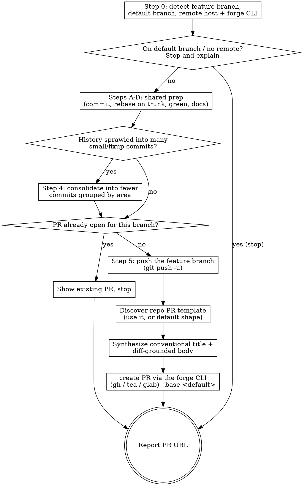

# PR

Open a pull request for the current feature branch. This is the "send it for
review" workflow: make sure the branch is committed and green, push it, and open
a PR whose title and description match the project's conventions.

## Non-negotiable guardrails

- **Push the feature branch only. Never push or merge the trunk.** Opening the
  PR requires pushing _this_ branch to the remote — that's the whole point and
  is authorized by running `/pr`. It does not push `main`/`master` and does not
  merge anything.
- **Title is a conventional commit.** The PR is most likely squash-merged into a
  single commit on the project, so its title becomes that commit's subject and
  must follow the exact same rules as every commit in this repo:
  `<type>(<scope>): <subject>`, imperative, lowercase subject, ≤70-char header,
  type from the allowed set (`build ci docs feat fix perf refactor style test` —
  there is no `chore`). Write it with the same care as a commit subject
  regardless of host.
- **The body describes only what's in the diff.** Every sentence must be
  verifiable from the changed files. Do **not** include rationale for _why_ the
  work was done, future or deferred work, open questions, concerns, risks, or
  anything else not captured in the code. Describe what the change _is_ and what
  it _does_, nothing more. This is the opposite of a commit body — there is no
  "why" here.
- **Honor the repo's PR template if it ships one.** When the project provides a
  pull-request template, fill _its_ structure rather than imposing the default
  shape below. The diff-grounded discipline still applies: populate each section
  factually from the changes and leave a section as `N/A` rather than inventing
  motivation, testing, or risk prose to fill it.
- **Open it ready for review** (not a draft) unless the user says otherwise.

## Why the title matters

The PR is most likely squash-merged into a single commit on the project, so the
PR title becomes that commit's subject. Hold it to the same conventional-commit
rules as a `git commit` subject and get it right the first time, regardless of
which forge or CLI you use.

## Workflow



### Step 0 — Detect the situation

```bash
git branch --show-current                                   # the branch to PR
git remote get-url origin                                    # is there a remote? which host?
git symbolic-ref --short refs/remotes/origin/HEAD 2>/dev/null  # e.g. origin/main → base branch
```

- **Default branch**: the PR's base. Derive it from git as above (strip the
  `origin/` prefix → usually `main`) rather than assuming. If that ref is
  missing, run `git remote set-head origin --auto` first, then re-read it.
- **Remote host → CLI**: pick the forge CLI that matches the remote, and use it
  for every PR operation below. There is no PR to open without a remote, so if
  `git remote get-url origin` fails, stop and say so.
  - `github.com` (or GitHub Enterprise) → **`gh`**
  - a Gitea / Forgejo host → **`tea`**
  - `gitlab.com` or a self-hosted GitLab → **`glab`**
  - For a self-hosted host you can't identify by name, pick the CLI whose
    configured logins include that host: `tea login list`, `glab auth status`,
    `gh auth status`.
  - If the matching CLI isn't installed or isn't authenticated for the host,
    stop and tell the user to install/authenticate it (e.g. `tea login add`,
    `glab auth login`, `gh auth login`) — don't fall back to another forge's CLI.

**Refuse early** if the current branch _is_ the default branch — you open a PR
_from_ a feature branch, not from `main`.

#### Command mapping per forge

The workflow below names operations abstractly (check-for-existing-PR,
create-PR). Use the row for your detected CLI. `<base>` is the default branch,
`<branch>` the current feature branch, `<body-file>` the temp file holding the
synthesized body.

| Operation                | GitHub (`gh`)                                                                 | Gitea / Forgejo (`tea`)                                                            | GitLab (`glab`)                                                              |
| ------------------------ | ---------------------------------------------------------------------------- | --------------------------------------------------------------------------------- | --------------------------------------------------------------------------- |
| Existing PR for branch   | `gh pr view --json url,state -q '.url + " (" + .state + ")"'`                 | `tea pr ls --head <branch> --output json --fields index,url,state`                | `glab mr list --source-branch <branch>`                                     |
| Create PR (ready)        | `gh pr create --base <base> --head <branch> --title "<title>" --body-file <body-file>` | `tea pr create --base <base> --head <branch> --title "<title>" --description "$(cat <body-file>)"` | `glab mr create --target-branch <base> --source-branch <branch> --title "<title>" --description "$(cat <body-file>)" --yes` |
| Open as draft (opt-in)   | add `--draft`                                                                 | append ` [WIP]` to the title (tea has no draft flag)                               | add `--draft`                                                                |

Notes that bite if ignored:

- **`tea` and `glab` take the body inline** via `--description`, not a
  `--body-file` flag — pass `"$(cat <body-file>)"`. Still write the body to the
  temp file first (it keeps multi-line/quoting sane and `/tmp` is exempt from the
  file-protection hooks).
- **`tea` has no "ready vs draft" flag.** A Gitea draft PR is just a title
  prefixed with `[WIP]`; only add it if the user asked for a draft.
- **`glab mr create` is interactive by default** — `--yes` (or `--fill` when you
  want it to derive title/body from commits) keeps it non-interactive.

### Steps A–D — Prepare the branch (shared)

**Read `../shared/finishing-prep.md`** (relative to this skill's base directory)
and perform every step in it before continuing. A PR reviews committed, green,
up-to-date history, so none of it is optional. The PR merges into the **remote**
default branch, so that prep's Step B rebases onto the remote trunk:

- **`<rebase-onto>`** = `origin/<default-branch>` (the remote ref the PR targets).

Return here once it's done.

### Step 4 — Consolidate a sprawling branch

A branch whose history reads as a few coherent, well-named commits is far easier
to review than the same change buried under a long trail of small or fixup-style
commits. Before pushing, repackage a sprawling branch into reviewable commits.

Because Step B already rebased this branch onto the trunk, the trunk is the
regroup base. Record the current tip first so the rewrite is verifiable, then run
the shared procedure:

```bash
orig=$(git rev-parse HEAD)   # tip before any rewrite, for the byte-identical check
```

**Read `../shared/regroup-history.md`** (relative to this skill's base directory)
and perform every step in it, with:

- **`<base>`** = the default branch (the trunk you rebased onto in Step B).
- **`<original-tip>`** = `$orig` (the SHA recorded just above).

That procedure judges whether the history has actually sprawled (and leaves a
already-clean branch untouched), groups the commits, rebuilds them with a soft
reset, and verifies the tree is byte-for-byte identical (restoring from `$orig` if
anything drifted). Return here when it is done, then continue to Step 5.

### Step 5 — Push and open the PR

First, guard against duplicates — if a PR is already open for this branch, don't
create a second one. Run the **Existing PR for branch** command for your forge
(see the Step 0 mapping table), e.g. on GitHub:

```bash
gh pr view --json url,state -q '.url + " (" + .state + ")"' 2>/dev/null
```

If that shows an open PR, show its URL and stop (offer to update it instead).

Otherwise push the feature branch and open the PR:

```bash
git push -u origin HEAD
```

If this push is rejected as non-fast-forward, the branch was pushed _before_ the
Step B rebase rewrote its history. Reconciling that needs a force push, which
this repo's `enforce_branch_protection` hook blocks (by design — it can clobber a
collaborator's work). **Do not try to force it.** Stop and ask the user to push
it themselves, e.g. `! git push --force-with-lease`, then resume.

Discover whether the repo ships a PR template — its presence decides the body's
structure. Check these paths in order and use the first that exists:

```bash
# directory of named templates (GitHub/Gitea/Forgejo, then GitLab)
ls .github/PULL_REQUEST_TEMPLATE/ .gitea/PULL_REQUEST_TEMPLATE/ \
   .forgejo/PULL_REQUEST_TEMPLATE/ .gitlab/merge_request_templates/ 2>/dev/null
# single-file templates across forges
ls .github/PULL_REQUEST_TEMPLATE.md .github/pull_request_template.md \
   .gitea/PULL_REQUEST_TEMPLATE.md .gitea/pull_request_template.md \
   .forgejo/PULL_REQUEST_TEMPLATE.md \
   docs/pull_request_template.md PULL_REQUEST_TEMPLATE.md 2>/dev/null
```

- **Directory of templates**: multiple templates. Pick `default.md` if present,
  otherwise ask the user which to use.
- **Single file**: read it; that's the body skeleton.
- **None found**: use the default Summary/Changes shape below.

Synthesize the two pieces against the full branch diff:

```bash
git log --oneline <default-branch>..HEAD   # the commits the PR will contain
git diff <default-branch>...HEAD            # the actual changes — ground truth
```

- **Title** — one conventional-commit subject summarizing the change, framed for
  a reader of the merged history.
- **Body** — a factual account of what changed, drawn strictly from the diff.
  Keep it concrete; do not editorialize.
  - **If a template was found**, fill _its_ sections — preserve every heading and
    its order. Populate each from the diff; leave any section that doesn't apply
    as `N/A` rather than inventing content. Honor template instructions you can
    satisfy factually (e.g. a checklist), and don't delete sections you can't.
    The diff-grounded rule still governs: a section asking "why" or "risks" gets
    `N/A` unless the answer is literally visible in the changes.
  - **If no template was found**, use this shape and resist adding anything else:

    ```markdown
    ## Summary

    <1–3 sentences stating what this change is and what it does, all verifiable in the diff>

    ## Changes

    - <concrete change, traceable to specific files/behavior>
    - <concrete change>
    ```

    Do not add "Motivation"/"Why", "Future work", "Notes", "Caveats", "Concerns",
    or "Testing" speculation. If you're tempted to write something the diff doesn't
    show, drop it.

Write the chosen body (template-filled or default) to a temp file (avoids
shell-quoting pitfalls; `/tmp` is exempt from the file-protection hooks), then
run the **Create PR** command for your forge from the Step 0 mapping table:

```bash
cat > /tmp/pr-body.md <<'EOF'
## Summary
...

## Changes
- ...
EOF

# GitHub example — substitute the row for your detected CLI:
gh pr create --base <default-branch> --head "$(git branch --show-current)" \
  --title "<type>(<scope>): <subject>" --body-file /tmp/pr-body.md
```

Open it ready for review by default. Make it a draft only if the user asked
(`--draft` on `gh`/`glab`; a `[WIP]` title prefix on `tea`, which has no draft
flag).

### Finish

Report the PR URL the create command printed. Note that the feature branch was
pushed but nothing was merged and the trunk was untouched — the merge is the
user's call (or a reviewer's).

## Common failure modes

| Symptom                         | Cause                                   | Do this                                                           |
| ------------------------------- | --------------------------------------- | ----------------------------------------------------------------- |
| Create blocked / title rejected | Title isn't a valid conventional commit | Fix the title; `chore` is not an allowed type here                |
| Push rejected (non-fast-forward) | Branch was pushed before the Step B rebase rewrote it | Don't force (hook blocks it); have the user `! git push --force-with-lease` |
| "a pull request already exists" | Branch already has an open PR           | Show the existing PR; update it instead of creating a duplicate   |
| Push prompt / no upstream       | Branch not pushed yet                   | `git push -u origin HEAD` before creating the PR                  |
| `tea`/`glab` opens an editor or hangs | Body/title not passed non-interactively | Pass `--description "$(cat <body-file>)"` (and `--yes` for `glab`); `tea` has no `--body-file` |
| Forge CLI not found / not authed | Matching CLI missing or not logged in for the host | Stop; have the user install and authenticate it (`tea login add`, `glab auth login`, `gh auth login`) |
| Body reads like a design doc    | Included why/future/concerns            | Cut anything not visible in the diff; keep Summary + Changes only |
| Repo template has empty/why sections | Template asks for content the diff doesn't show | Mark those sections `N/A`; never invent prose to fill them |
| No remote                       | Nowhere to open a PR                    | Stop; tell the user to set a remote                               |
