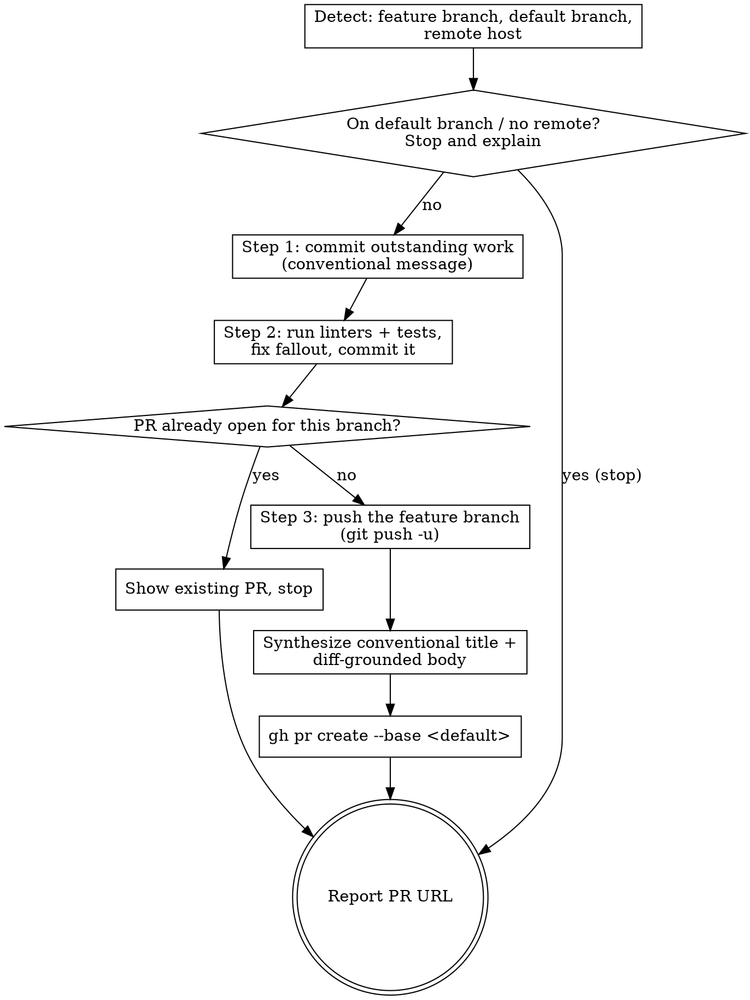

# PR

Open a pull request for the current feature branch. This is the "send it for
review" workflow: make sure the branch is committed and green, push it, and open
a PR whose title and description match the project's conventions.

## Non-negotiable guardrails

- **Push the feature branch only. Never push or merge the trunk.** Opening the
  PR requires pushing *this* branch to the remote — that's the whole point and
  is authorized by running `/pr`. It does not push `main`/`master` and does not
  merge anything.
- **Title is a conventional commit.** The PR becomes a commit on merge, so its
  title follows the exact same rules as every commit in this repo:
  `<type>(<scope>): <subject>`, imperative, lowercase subject, ≤70-char header,
  type from the allowed set (`build ci docs feat fix perf refactor style test` —
  there is no `chore`). The `enforce_commit_message` hook validates the
  `gh pr create` title and will reject anything else.
- **The body describes only what's in the diff.** Every sentence must be
  verifiable from the changed files. Do **not** include rationale for *why* the
  work was done, future or deferred work, open questions, concerns, risks, or
  anything else not captured in the code. Describe what the change *is* and what
  it *does*, nothing more. This is the opposite of a commit body — there is no
  "why" here.
- **Open it ready for review** (not a draft) unless the user says otherwise.

## Why the title is hook-validated

This repo's `enforce_commit_message` hook intercepts `gh pr create` and holds
the `--title` to the same conventional-commit rules as a `git commit` subject (a
PR title becomes the squash-merge subject). A malformed title blocks the create.
So synthesize the title with the same care as a commit subject — get it right
the first time rather than discovering the block at `gh pr create`.

## Workflow



### Step 0 — Detect the situation

```bash
git branch --show-current                                   # the branch to PR
git remote -v                                                # is there a remote?
gh repo view --json defaultBranchRef -q .defaultBranchRef.name   # base branch
```

- **Default branch**: the PR's base. Read it from `gh` as above (usually `main`)
  rather than assuming.
- **Remote host**: this repo uses GitHub, so `gh` is the tool. If the remote is
  a different host (e.g. GitLab), use that host's CLI (`glab mr create`) with the
  same title/body discipline. If there is no remote at all, stop and say so —
  there's nowhere to open a PR.

**Refuse early** if the current branch *is* the default branch — you open a PR
*from* a feature branch, not from `main`.

### Step 1 — Commit outstanding work

A PR reviews committed history, so commit anything outstanding first.

```bash
git status --porcelain    # anything here must be committed
```

If dirty, stage and commit with a conventional message describing the changes:

```bash
git add -A
git commit -m "<type>(<scope>): <subject>"
```

If the tree is already clean, skip this step.

### Step 2 — Get the branch green

Don't send red work for review. Run every linter and test suite the project
defines, fix whatever they flag, and commit the fixes.

```bash
# Use the project's actual tooling — discover it, don't assume. For this repo:
uv run ruff check . && uv run ruff format . && uv run ty check
uv run pytest
```

Other projects may use `npm test`, `make lint`, `pre-commit run --all-files`,
etc. — read the repo's config (`pyproject.toml`, `package.json`, `Makefile`,
CI workflows) for the real commands. Fix and re-run until clean, then commit:

```bash
git add -A
git commit -m "<type>(<scope>): <subject>"
```

If everything already passes and nothing changed, there's nothing to commit.
**Do not open a PR with failing linters or tests.**

### Step 3 — Push and open the PR

First, guard against duplicates — if a PR is already open for this branch, don't
create a second one:

```bash
gh pr view --json url,state -q '.url + " (" + .state + ")"' 2>/dev/null
```

If that prints an open PR, show its URL and stop (offer to update it instead).

Otherwise push the feature branch and open the PR:

```bash
git push -u origin HEAD
```

Synthesize the two pieces against the full branch diff:

```bash
git log --oneline <default-branch>..HEAD   # the commits the PR will contain
git diff <default-branch>...HEAD            # the actual changes — ground truth
```

- **Title** — one conventional-commit subject summarizing the change, framed for
  a reader of the merged history.
- **Body** — a factual account of what changed, drawn strictly from the diff.
  Keep to a short summary plus concrete changes; do not editorialize. Use this
  shape and resist adding anything else:

  ```markdown
  ## Summary
  <1–3 sentences stating what this change is and what it does, all verifiable in the diff>

  ## Changes
  - <concrete change, traceable to specific files/behavior>
  - <concrete change>
  ```

  Do not add "Motivation"/"Why", "Future work", "Notes", "Caveats", "Concerns",
  or "Testing" speculation. If you're tempted to write something the diff doesn't
  show, drop it.

Write the body to a temp file (avoids shell-quoting pitfalls; `/tmp` is exempt
from the file-protection hooks) and create the PR:

```bash
cat > /tmp/pr-body.md <<'EOF'
## Summary
...

## Changes
- ...
EOF

gh pr create --base <default-branch> --head "$(git branch --show-current)" \
  --title "<type>(<scope>): <subject>" --body-file /tmp/pr-body.md
```

Omit `--draft` (ready for review by default). Add `--draft` only if the user
asked for a draft.

### Finish

Report the PR URL that `gh pr create` printed. Note that the feature branch was
pushed but nothing was merged and the trunk was untouched — the merge is the
user's call (or a reviewer's).

## Common failure modes

| Symptom | Cause | Do this |
|---|---|---|
| `gh pr create` blocked | Title isn't a valid conventional commit | Fix the title; `chore` is not an allowed type here |
| "a pull request already exists" | Branch already has an open PR | Show the existing PR; update it instead of creating a duplicate |
| `gh` push prompt / no upstream | Branch not pushed yet | `git push -u origin HEAD` before `gh pr create` |
| Body reads like a design doc | Included why/future/concerns | Cut anything not visible in the diff; keep Summary + Changes only |
| No remote / `gh` not authed | Nowhere to open a PR | Stop; tell the user to set a remote or run `gh auth login` |
