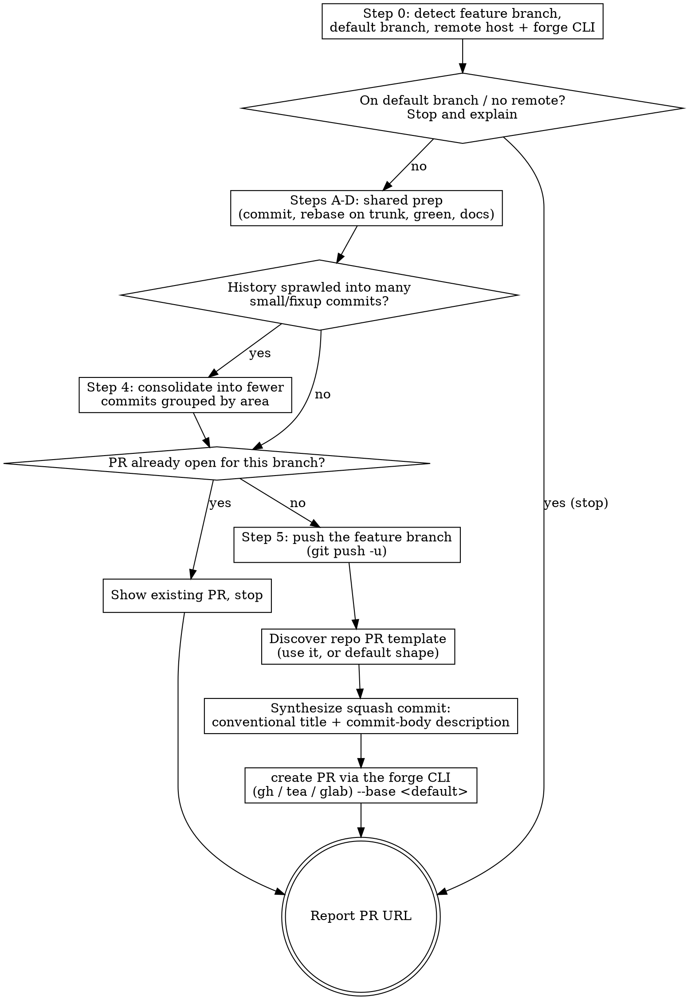

# PR

Open a pull request for the current feature branch. This is the "send it for
review" workflow: make sure the branch is committed and green, push it, and open
a PR whose title and description match the project's conventions.

## Non-negotiable guardrails

- **Push the feature branch only. Never push or merge the trunk.** Opening the
  PR requires pushing _this_ branch to the remote — that's the whole point and
  is authorized by running `/pr`. It does not push `main`/`master` and does not
  merge anything.
- **Title and description lead ARE the squash commit.** The PR is
  squash-merged: the title becomes the commit subject, and the description's
  lead block — everything above the first markdown heading — becomes the commit
  body. Write both under the exact same rules as every commit in this repo:
  - **Title = subject.** `<type>(<scope>): <subject>`, imperative, lowercase
    subject, ≤70-char header, type from the allowed set
    (`build ci docs feat fix perf refactor style test` — there is no `chore`).
  - **Description opens with the body.** The lead block is prose paragraphs
    explaining the motivation for the change — the _why_, not a file-by-file
    _what_ (the diff already shows that) — separated by blank lines, wrapped at
    ~72 characters so the squashed commit reads cleanly in `git log`. No
    headings, checklists, or bullet changelogs inside this block.
  - **Review sections below.** After the lead block, markdown sections
    (`## Changes`, `## Testing`, screenshots) are welcome when they genuinely
    help a reviewer. They stay with the PR and are not part of the commit.
- **Breaking changes carry both markers.** A breaking change needs `!` before
  the colon in the title **and** a `BREAKING CHANGE: <impact and migration>`
  paragraph closing the lead block (the last paragraph before any heading).
  Whenever you write one, write the other — a `!` title without the footer (or
  vice versa) is malformed.
- **Stay factual.** Every claim must be true of this branch. No future or
  deferred work, no open questions, no concerns or speculation — the motivation
  for what the change does belongs in the body; plans for what it doesn't do
  don't.
- **Honor the repo's PR template if it ships one.** When the project provides a
  pull-request template, fill _its_ structure rather than imposing the
  commit-body shape below. The factual discipline still applies: populate each
  section truthfully (a motivation section gets the real why) and leave a
  section as `N/A` rather than inventing content to fill it.
- **Open it ready for review** (not a draft) unless the user says otherwise.

## Why the format matters

Squash-merging replays the PR as one commit whose subject is the PR title and
whose body is the description's lead block — the paragraphs above the first
markdown heading. That lead block lands in `git log` byte for byte, so anything
wrong with it — paragraphs run together without blank lines, unwrapped
300-character lines, a `!` subject with no `BREAKING CHANGE:` footer — lands in
the project history exactly that wrong. Sections after the first heading exist
for reviewers and stay behind on the PR page. Write the title and lead block as
the commit message they will become, and get them right the first time,
regardless of which forge or CLI you use.

## Workflow


```dot
digraph pr {
  rankdir=TB; node [shape=box];
  detect   [label="Step 0: detect feature branch,\ndefault branch, remote host + forge CLI"];
  refuse   [label="On default branch / no remote?\nStop and explain" shape=diamond];
  prep     [label="Steps A-D: shared prep\n(commit, rebase on trunk, green, docs)"];
  many     [label="History sprawled into many\nsmall/fixup commits?" shape=diamond];
  regroup   [label="Step 4: consolidate into fewer\ncommits grouped by area"];
  exists   [label="PR already open for this branch?" shape=diamond];
  show     [label="Show existing PR, stop"];
  push     [label="Step 5: push the feature branch\n(git push -u)"];
  tmpl     [label="Discover repo PR template\n(use it, or default shape)"];
  body     [label="Synthesize squash commit:\nconventional title + commit-body description"];
  create   [label="create PR via the forge CLI\n(gh / tea / glab) --base <default>"];
  done     [label="Report PR URL" shape=doublecircle];

  detect -> refuse;
  refuse -> done [label="yes (stop)"];
  refuse -> prep [label="no"];
  prep -> many;
  many -> regroup [label="yes"];
  many -> exists [label="no"];
  regroup -> exists;
  exists -> show [label="yes"];
  show -> done;
  exists -> push [label="no"];
  push -> tmpl -> body -> create -> done;
}
```

### Step 0 — Detect the situation

```bash
git branch --show-current                                   # the branch to PR
git remote get-url origin                                    # is there a remote? which host?
git symbolic-ref --short refs/remotes/origin/HEAD 2>/dev/null  # e.g. origin/main → base branch
```

- **Default branch**: the PR's base. Derive it from git as above (strip the
  `origin/` prefix → usually `main`) rather than assuming. If that ref is
  missing, run `git remote set-head origin --auto` first, then re-read it.
- **Remote host → CLI**: pick the forge CLI that matches the remote, and use it
  for every PR operation below. There is no PR to open without a remote, so if
  `git remote get-url origin` fails, stop and say so.
  - `github.com` (or GitHub Enterprise) → **`gh`**
  - a Gitea / Forgejo host → **`tea`**
  - `gitlab.com` or a self-hosted GitLab → **`glab`**
  - For a self-hosted host you can't identify by name, pick the CLI whose
    configured logins include that host: `tea login list`, `glab auth status`,
    `gh auth status`.
  - If the matching CLI isn't installed or isn't authenticated for the host,
    stop and tell the user to install/authenticate it (e.g. `tea login add`,
    `glab auth login`, `gh auth login`) — don't fall back to another forge's CLI.

**Refuse early** if the current branch _is_ the default branch — you open a PR
_from_ a feature branch, not from `main`.

#### Command mapping per forge

The workflow below names operations abstractly (check-for-existing-PR,
create-PR). Use the row for your detected CLI. `<base>` is the default branch,
`<branch>` the current feature branch, `<body-file>` the temp file holding the
synthesized body.

| Operation                | GitHub (`gh`)                                                                 | Gitea / Forgejo (`tea`)                                                            | GitLab (`glab`)                                                              |
| ------------------------ | ---------------------------------------------------------------------------- | --------------------------------------------------------------------------------- | --------------------------------------------------------------------------- |
| Existing PR for branch   | `gh pr view --json url,state -q '.url + " (" + .state + ")"'`                 | `tea pr ls --head <branch> --output json --fields index,url,state`                | `glab mr list --source-branch <branch>`                                     |
| Create PR (ready)        | `gh pr create --base <base> --head <branch> --title "<title>" --body-file <body-file>` | `tea pr create --base <base> --head <branch> --title "<title>" --description "$(cat <body-file>)"` | `glab mr create --target-branch <base> --source-branch <branch> --title "<title>" --description "$(cat <body-file>)" --yes` |
| Open as draft (opt-in)   | add `--draft`                                                                 | append ` [WIP]` to the title (tea has no draft flag)                               | add `--draft`                                                                |

Notes that bite if ignored:

- **`tea` and `glab` take the body inline** via `--description`, not a
  `--body-file` flag — pass `"$(cat <body-file>)"`. Still write the body to the
  temp file first (it keeps multi-line/quoting sane and `/tmp` is exempt from the
  file-protection hooks).
- **`tea` has no "ready vs draft" flag.** A Gitea draft PR is just a title
  prefixed with `[WIP]`; only add it if the user asked for a draft.
- **`glab mr create` is interactive by default** — `--yes` (or `--fill` when you
  want it to derive title/body from commits) keeps it non-interactive.

### Steps A–D — Prepare the branch (shared)

**Read `../shared/finishing-prep.md`** (relative to this skill's base directory)
and perform every step in it before continuing. A PR reviews committed, green,
up-to-date history, so none of it is optional. The PR merges into the **remote**
default branch, so that prep's Step B rebases onto the remote trunk:

- **`<rebase-onto>`** = `origin/<default-branch>` (the remote ref the PR targets).

Return here once it's done.

### Step 4 — Consolidate a sprawling branch

A branch whose history reads as a few coherent, well-named commits is far easier
to review than the same change buried under a long trail of small or fixup-style
commits. Before pushing, repackage a sprawling branch into reviewable commits.

Because Step B already rebased this branch onto the trunk, the trunk is the
regroup base. Record the current tip first so the rewrite is verifiable, then run
the shared procedure:

```bash
orig=$(git rev-parse HEAD)   # tip before any rewrite, for the byte-identical check
```

**Read `../shared/regroup-history.md`** (relative to this skill's base directory)
and perform every step in it, with:

- **`<base>`** = the default branch (the trunk you rebased onto in Step B).
- **`<original-tip>`** = `$orig` (the SHA recorded just above).

That procedure judges whether the history has actually sprawled (and leaves a
already-clean branch untouched), groups the commits, rebuilds them with a soft
reset, and verifies the tree is byte-for-byte identical (restoring from `$orig` if
anything drifted). Return here when it is done, then continue to Step 5.

### Step 5 — Push and open the PR

First, guard against duplicates — if a PR is already open for this branch, don't
create a second one. Run the **Existing PR for branch** command for your forge
(see the Step 0 mapping table), e.g. on GitHub:

```bash
gh pr view --json url,state -q '.url + " (" + .state + ")"' 2>/dev/null
```

If that shows an open PR, show its URL and stop (offer to update it instead).

Otherwise push the feature branch and open the PR:

```bash
git push -u origin HEAD
```

If this push is rejected as non-fast-forward, the branch was pushed _before_ the
Step B rebase rewrote its history. Reconciling that needs a force push, which
this repo's `enforce_branch_protection` hook blocks (by design — it can clobber a
collaborator's work). **Do not try to force it.** Stop and ask the user to push
it themselves, e.g. `! git push --force-with-lease`, then resume.

Discover whether the repo ships a PR template — its presence decides the body's
structure. Check these paths in order and use the first that exists:

```bash
# directory of named templates (GitHub/Gitea/Forgejo, then GitLab)
ls .github/PULL_REQUEST_TEMPLATE/ .gitea/PULL_REQUEST_TEMPLATE/ \
   .forgejo/PULL_REQUEST_TEMPLATE/ .gitlab/merge_request_templates/ 2>/dev/null
# single-file templates across forges
ls .github/PULL_REQUEST_TEMPLATE.md .github/pull_request_template.md \
   .gitea/PULL_REQUEST_TEMPLATE.md .gitea/pull_request_template.md \
   .forgejo/PULL_REQUEST_TEMPLATE.md \
   docs/pull_request_template.md PULL_REQUEST_TEMPLATE.md 2>/dev/null
```

- **Directory of templates**: multiple templates. Pick `default.md` if present,
  otherwise ask the user which to use.
- **Single file**: read it; that's the body skeleton.
- **None found**: open the description with a plain commit body, optional
  review sections after it (shape below).

Synthesize the two pieces against the full branch diff:

```bash
git log --oneline <default-branch>..HEAD   # the commits the PR will contain
git diff <default-branch>...HEAD            # the actual changes — ground truth
```

- **Title** — the squash commit's subject: one conventional-commit header
  summarizing the whole branch, framed for a reader of the merged history. Add
  `!` before the colon when the branch breaks a public contract.
- **Description** — opens with the squash commit's body; review sections may
  follow it.
  - **If a template was found**, fill _its_ sections — preserve every heading and
    its order. Populate each truthfully (a motivation section gets the real why);
    leave any section that doesn't apply as `N/A` rather than inventing content.
    Honor template instructions you can satisfy (e.g. a checklist), and don't
    delete sections you can't.
  - **If no template was found**, open with the commit body: a few prose
    paragraphs explaining the motivation for the change, in the imperative
    present tense, blank line between paragraphs, lines wrapped at ~72
    characters, and — when the title carries `!` — the `BREAKING CHANGE:`
    footer as the block's last paragraph. Below that lead block, add `##`
    sections only when they earn their place for a reviewer (a change list for
    a sprawling diff, test notes, screenshots); they stay with the PR when the
    lead block becomes the commit body:

    ```text
    <why the change is needed and what approach it takes, as one or more
    wrapped paragraphs separated by blank lines>

    BREAKING CHANGE: <what breaks and how callers migrate — present
    exactly when the title has `!`, absent otherwise>

    ## Changes

    - <optional review sections from here down; PR-only, never squashed>
    ```

Write the chosen body (template-filled or default) to a temp file (avoids
shell-quoting pitfalls; `/tmp` is exempt from the file-protection hooks), then
run the **Create PR** command for your forge from the Step 0 mapping table:

```bash
cat > /tmp/pr-body.md <<'EOF'
<commit-body paragraphs, blank-line separated, wrapped at ~72 chars>

BREAKING CHANGE: <footer, only when the title has `!`>

## Changes

- <optional review-only sections below the lead block>
EOF

# GitHub example — substitute the row for your detected CLI:
gh pr create --base <default-branch> --head "$(git branch --show-current)" \
  --title "<type>(<scope>): <subject>" --body-file /tmp/pr-body.md
```

Open it ready for review by default. Make it a draft only if the user asked
(`--draft` on `gh`/`glab`; a `[WIP]` title prefix on `tea`, which has no draft
flag).

### Finish

Report the PR URL the create command printed. Note that the feature branch was
pushed but nothing was merged and the trunk was untouched — the merge is the
user's call (or a reviewer's).

## Common failure modes

| Symptom                         | Cause                                   | Do this                                                           |
| ------------------------------- | --------------------------------------- | ----------------------------------------------------------------- |
| Create blocked / title rejected | Title isn't a valid conventional commit | Fix the title; `chore` is not an allowed type here                |
| Push rejected (non-fast-forward) | Branch was pushed before the Step B rebase rewrote it | Don't force (hook blocks it); have the user `! git push --force-with-lease` |
| "a pull request already exists" | Branch already has an open PR           | Show the existing PR; update it instead of creating a duplicate   |
| Push prompt / no upstream       | Branch not pushed yet                   | `git push -u origin HEAD` before creating the PR                  |
| `tea`/`glab` opens an editor or hangs | Body/title not passed non-interactively | Pass `--description "$(cat <body-file>)"` (and `--yes` for `glab`); `tea` has no `--body-file` |
| Forge CLI not found / not authed | Matching CLI missing or not logged in for the host | Stop; have the user install and authenticate it (`tea login add`, `glab auth login`, `gh auth login`) |
| Body reads like a design doc    | Included future work, open questions, or speculation | Cut it; keep the motivation paragraphs (plus the footer when breaking) |
| Description starts with a heading | Commit body missing or buried below review sections | Motivation paragraphs (and footer) go above the first `##`; sections after |
| Squashed body is one dense block | Lead paragraphs not blank-line separated, lines unwrapped | Blank line between paragraphs; wrap at ~72 chars |
| Title has `!` but no footer (or vice versa) | Breaking marker applied in only one place | Add the missing `BREAKING CHANGE:` footer (last paragraph of the lead block) or `!` — or drop both if not breaking |
| Repo template has sections you can't fill | Template asks for content that isn't true of this branch | Mark those sections `N/A`; never invent prose to fill them |
| No remote                       | Nowhere to open a PR                    | Stop; tell the user to set a remote                               |
