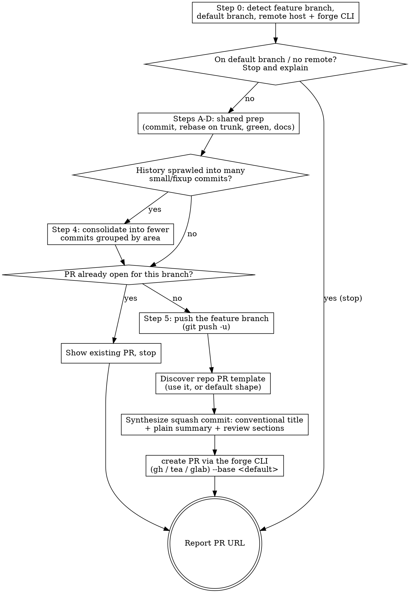

# PR

Open a pull request for the current feature branch. This is the "send it for
review" workflow: make sure the branch is committed and green, push it, and open
a PR whose title and description match the project's conventions.

## Non-negotiable guardrails

- **Push the feature branch only. Never push or merge the trunk.** Opening the
  PR requires pushing _this_ branch to the remote — that's the whole point and
  is authorized by running `/pr`. It does not push `main`/`master` and does not
  merge anything.
- **Title and description lead ARE the squash commit.** The PR is
  squash-merged: the title becomes the commit subject, and the description's
  lead block (everything above the first markdown heading) becomes the commit
  body. It lands in `git log` byte for byte, so anything wrong with it lands in
  the project history exactly that wrong. Write both under the exact same rules
  as every commit in this repo:
  - **Title = subject.** `<type>(<scope>): <subject>`, imperative, lowercase
    subject, ≤70-char header, type from the allowed set
    (`build ci docs feat fix perf refactor style test` — there is no `chore`).
  - **Description opens with a plain summary: one to three sentences saying
    what this change is and what it does.** Every sentence must be verifiable
    from the diff.
    - **Name the thing.** Say which feature, command, flag, or behavior this
      is, the way someone who has never seen the branch needs it named.
      "Adds `--dry-run` to `prune`, which reports what would be deleted and
      exits without touching the destination" tells a reader what the change
      is; a sentence describing the state of the world the branch leaves
      behind makes them work it out. Concrete beats elegant.
    - **One idea per sentence.** Plain declaratives, not three clauses deep.
      If a sentence is accumulating detail, that detail belongs in
      `## Changes`, which exists precisely to hold it.
    - **Motivation is a clause, not a paragraph.** Give the why only where the
      change reads as arbitrary without it, usually a fix, where the failure
      mode _is_ the point. Never open with a setup paragraph establishing that
      the feature was missing; adding it says that already.
    - It's a synthesis of the whole branch, not a promotion of its biggest
      commit. **Never paste a commit's body into it**, and never write a
      paragraph per commit; `git log` and the diff carry that.
    - Wrap at 72 characters, blank line between paragraphs if there's more
      than one, so the squashed commit reads cleanly in `git log`. No headings,
      checklists, or bullet lists inside this block.
  - **Review sections below.** After the lead block, markdown sections
    (`## Changes`, `## Testing`, screenshots) are welcome and `## Changes` is
    usually worth writing. They stay with the PR and are not part of the
    commit. They must not restate the lead block: a section that recaps the
    summary in the same words is padding, but listing the concrete changes the
    summary deliberately left out is exactly the point.
- **Breaking changes carry both markers, and they're inherited, not
  re-judged.** A breaking change needs `!` before the colon in the title **and**
  a `BREAKING CHANGE: <impact and migration>` paragraph closing the lead block
  (the last paragraph before any heading). Whenever you write one, write the
  other; a `!` title without the footer (or vice versa) is malformed.
  - **If _any_ commit on the branch is breaking, the PR is breaking.** The
    squash collapses the branch into one commit, so a `!` or `BREAKING CHANGE:`
    footer anywhere in `<base>..HEAD` has exactly one place left to land: the
    PR's title and lead block. Scan the commits for both markers and carry them
    up. A breaking commit under a non-breaking PR title silently drops the break
    from the history the moment it merges.
  - **Don't demote a break into a review section.** Prose describing what now
    fails for existing callers is not a substitute for the markers. A break
    written up under `## Behavior changes for existing users` but missing from
    the title and footer is still an unmarked breaking change. If you're
    describing something that breaks a public contract (a changed exit code,
    a removed or renamed flag, a new required argument, a changed default that
    alters output contracts), the markers are required and the section is
    optional detail on top.
- **Stay factual.** Every claim must be true of this branch and visible in the
  diff. No future or deferred work, no open questions, no concerns or
  speculation. What the change does belongs in the description; plans for what
  it doesn't do don't.
- **Honor the repo's PR template if it ships one.** When the project provides a
  pull-request template, fill _its_ structure rather than imposing the
  summary-plus-sections shape below. The factual discipline still applies: populate each
  section truthfully (a motivation section gets the real why) and leave a
  section as `N/A` rather than inventing content to fill it.
- **Open it ready for review** (not a draft) unless the user says otherwise.

## Workflow


```dot
digraph pr {
  rankdir=TB; node [shape=box];
  detect   [label="Step 0: detect feature branch,\ndefault branch, remote host + forge CLI"];
  refuse   [label="On default branch / no remote?\nStop and explain" shape=diamond];
  prep     [label="Steps A-D: shared prep\n(commit, rebase on trunk, green, docs)"];
  many     [label="History sprawled into many\nsmall/fixup commits?" shape=diamond];
  regroup   [label="Step 4: consolidate into fewer\ncommits grouped by area"];
  exists   [label="PR already open for this branch?" shape=diamond];
  show     [label="Show existing PR, stop"];
  push     [label="Step 5: push the feature branch\n(git push -u)"];
  tmpl     [label="Discover repo PR template\n(use it, or default shape)"];
  body     [label="Synthesize squash commit: conventional title\n+ plain summary + review sections"];
  create   [label="create PR via the forge CLI\n(gh / tea / glab) --base <default>"];
  done     [label="Report PR URL" shape=doublecircle];

  detect -> refuse;
  refuse -> done [label="yes (stop)"];
  refuse -> prep [label="no"];
  prep -> many;
  many -> regroup [label="yes"];
  many -> exists [label="no"];
  regroup -> exists;
  exists -> show [label="yes"];
  show -> done;
  exists -> push [label="no"];
  push -> tmpl -> body -> create -> done;
}
```

### Step 0 — Detect the situation

```bash
git branch --show-current                                   # the branch to PR
git remote get-url origin                                    # is there a remote? which host?
git symbolic-ref --short refs/remotes/origin/HEAD 2>/dev/null  # e.g. origin/main → base branch
```

- **Default branch**: the PR's base. Derive it from git as above (strip the
  `origin/` prefix → usually `main`) rather than assuming. If that ref is
  missing, run `git remote set-head origin --auto` first, then re-read it.
- **Remote host → CLI**: pick the forge CLI that matches the remote, and use it
  for every PR operation below. There is no PR to open without a remote, so if
  `git remote get-url origin` fails, stop and say so.
  - `github.com` (or GitHub Enterprise) → **`gh`**
  - a Gitea / Forgejo host → **`tea`**
  - `gitlab.com` or a self-hosted GitLab → **`glab`**
  - For a self-hosted host you can't identify by name, pick the CLI whose
    configured logins include that host: `tea login list`, `glab auth status`,
    `gh auth status`.
  - If the matching CLI isn't installed or isn't authenticated for the host,
    stop and tell the user to install/authenticate it (e.g. `tea login add`,
    `glab auth login`, `gh auth login`) — don't fall back to another forge's CLI.

**Refuse early** if the current branch _is_ the default branch — you open a PR
_from_ a feature branch, not from `main`.

#### Command mapping per forge

The workflow below names operations abstractly (check-for-existing-PR,
create-PR). Use the row for your detected CLI. `<base>` is the default branch,
`<branch>` the current feature branch, `<body-file>` the temp file holding the
synthesized body.

| Operation                | GitHub (`gh`)                                                                 | Gitea / Forgejo (`tea`)                                                            | GitLab (`glab`)                                                              |
| ------------------------ | ---------------------------------------------------------------------------- | --------------------------------------------------------------------------------- | --------------------------------------------------------------------------- |
| Existing PR for branch   | `gh pr view --json url,state -q '.url + " (" + .state + ")"'`                 | `tea pr ls --head <branch> --output json --fields index,url,state`                | `glab mr list --source-branch <branch>`                                     |
| Create PR (ready)        | `gh pr create --base <base> --head <branch> --title "<title>" --body-file <body-file>` | `tea pr create --base <base> --head <branch> --title "<title>" --description "$(cat <body-file>)"` | `glab mr create --target-branch <base> --source-branch <branch> --title "<title>" --description "$(cat <body-file>)" --yes` |
| Open as draft (opt-in)   | add `--draft`                                                                 | append ` [WIP]` to the title (tea has no draft flag)                               | add `--draft`                                                                |

Notes that bite if ignored:

- **`tea` and `glab` take the body inline** via `--description`, not a
  `--body-file` flag — pass `"$(cat <body-file>)"`. Still write the body to the
  temp file first (it keeps multi-line/quoting sane and `/tmp` is exempt from the
  file-protection hooks).
- **`tea` has no "ready vs draft" flag.** A Gitea draft PR is just a title
  prefixed with `[WIP]`; only add it if the user asked for a draft.
- **`glab mr create` is interactive by default** — `--yes` (or `--fill` when you
  want it to derive title/body from commits) keeps it non-interactive.

### Steps A–D — Prepare the branch (shared)

**Read `../shared/finishing-prep.md`** (relative to this skill's base directory)
and perform every step in it before continuing. A PR reviews committed, green,
up-to-date history, so none of it is optional. The PR merges into the **remote**
default branch, so that prep's Step B rebases onto the remote trunk:

- **`<rebase-onto>`** = `origin/<default-branch>` (the remote ref the PR targets).

Return here once it's done.

### Step 4 — Consolidate a sprawling branch

A branch whose history reads as a few coherent, well-named commits is far easier
to review than the same change buried under a long trail of small or fixup-style
commits. Before pushing, repackage a sprawling branch into reviewable commits.

Because Step B already rebased this branch onto the trunk, the trunk is the
regroup base. Record the current tip first so the rewrite is verifiable, then run
the shared procedure:

```bash
orig=$(git rev-parse HEAD)   # tip before any rewrite, for the byte-identical check
```

**Read `../shared/regroup-history.md`** (relative to this skill's base directory)
and perform every step in it, with:

- **`<base>`** = the default branch (the trunk you rebased onto in Step B).
- **`<original-tip>`** = `$orig` (the SHA recorded just above).

That procedure judges whether the history has actually sprawled (and leaves a
already-clean branch untouched), groups the commits, rebuilds them with a soft
reset, and verifies the tree is byte-for-byte identical (restoring from `$orig` if
anything drifted). Each group commit is made with `--no-verify`, because the index
is partial by design at that point: so the project's git `pre-commit` hooks would
either fail on an incomplete slice or reformat files and break the byte-identical
guarantee. The procedure closes by running the project's full gate once over the
finished tree; that is where hook enforcement happens, not per group commit.

Return here when it is done, then continue to Step 5. **If its closing gate came
back red, do not open the PR.** The tree is unchanged from the branch you started
with, so report the failures and stop.

### Step 5 — Push and open the PR

First, guard against duplicates — if a PR is already open for this branch, don't
create a second one. Run the **Existing PR for branch** command for your forge
(see the Step 0 mapping table), e.g. on GitHub:

```bash
gh pr view --json url,state -q '.url + " (" + .state + ")"' 2>/dev/null
```

If that shows an open PR, show its URL and stop (offer to update it instead).

Otherwise push the feature branch and open the PR:

```bash
git push -u origin HEAD
```

If this push is rejected as non-fast-forward, the branch was pushed _before_ the
Step B rebase rewrote its history. Reconciling that needs a force push, which
this repo's `enforce_branch_protection` hook blocks (by design — it can clobber a
collaborator's work). **Do not try to force it.** Stop and ask the user to push
it themselves, e.g. `! git push --force-with-lease`, then resume.

Discover whether the repo ships a PR template — its presence decides the body's
structure. Check these paths in order and use the first that exists:

```bash
# directory of named templates (GitHub/Gitea/Forgejo, then GitLab)
ls .github/PULL_REQUEST_TEMPLATE/ .gitea/PULL_REQUEST_TEMPLATE/ \
   .forgejo/PULL_REQUEST_TEMPLATE/ .gitlab/merge_request_templates/ 2>/dev/null
# single-file templates across forges
ls .github/PULL_REQUEST_TEMPLATE.md .github/pull_request_template.md \
   .gitea/PULL_REQUEST_TEMPLATE.md .gitea/pull_request_template.md \
   .forgejo/PULL_REQUEST_TEMPLATE.md \
   docs/pull_request_template.md PULL_REQUEST_TEMPLATE.md 2>/dev/null
```

- **Directory of templates**: multiple templates. Pick `default.md` if present,
  otherwise ask the user which to use.
- **Single file**: read it; that's the body skeleton.
- **None found**: open the description with a plain summary, then `## Changes`
  and any other review sections (shape below).

Synthesize the two pieces against the full branch diff:

```bash
git log --oneline <default-branch>..HEAD   # the commits the PR will contain
git diff <default-branch>...HEAD            # the actual changes — ground truth
```

Then check whether the branch already declared a break, so the PR inherits it:

```bash
# breaking subjects (the `!` form) and breaking footers, anywhere on the branch
git log <default-branch>..HEAD --format='%s' | grep -E '^[a-z]+(\([^)]*\))?!:'
git log <default-branch>..HEAD --format='%B' | grep -F 'BREAKING CHANGE'
```

**A hit in either means the PR is breaking.** The title takes `!` and the lead
block takes the footer, no re-litigating. Merge multiple breaking commits into
one footer covering every break and its migration. No hit doesn't settle it:
judge the diff too, since a branch can break a contract without any commit
having said so.

- **Title** — the squash commit's subject: one conventional-commit header
  summarizing the whole branch, framed for a reader of the merged history. Add
  `!` before the colon when any commit above is breaking, or when the branch
  breaks a public contract regardless of how its commits were worded.
- **Description** — opens with the plain summary that becomes the squash
  commit's body; review sections follow it.
  - **If a template was found**, fill _its_ sections — preserve every heading and
    its order. Populate each truthfully (a motivation section gets the real why);
    leave any section that doesn't apply as `N/A` rather than inventing content.
    Honor template instructions you can satisfy (e.g. a checklist), and don't
    delete sections you can't.
  - **If no template was found**, open with a plain summary: one to three
    sentences saying what this change is and what it does, wrapped at 72
    characters, plus the `BREAKING CHANGE:` footer as the block's last
    paragraph when the title carries `!`.

    **Say what it is, in the words a stranger to the branch would need.** Name
    the feature, command, flag, or behavior outright and say what it does.
    A reader finishing these sentences should be able to describe the change
    to someone else. If instead they have to infer it from a description of
    how things now stand, rewrite it.

    **Keep the sentences plain and then stop.** One idea each; no three-clause
    sentences packing in flags and API names. Detail is not lost by leaving it
    out; `## Changes` is where it goes. Motivation appears only where the
    change would read as arbitrary without it (typically a fix, where the
    failure mode is the whole point), and then as a clause. Don't open with a
    paragraph establishing that the feature was missing. This is a synthesis
    over `<default-branch>..HEAD`, so a summary that could be lifted from a
    single commit's message unchanged is pitched too low.

    Below the lead block, add `##` sections carrying the detail the summary
    left out:

    - **`## Changes`**: a bulleted recap of the changes that matter, so a
      reviewer doesn't have to reconstruct them from the diff. This is where
      the flag names, API surfaces, and mechanics the summary stayed clear of
      belong. Group by what changed for a user of the code, not by commit, and
      skip the mechanical churn. Write it unless the branch is genuinely a
      one-liner.
    - **Behavior changes for existing users**: changes that alter how an
      already-deployed or already-installed setup behaves without breaking a
      public contract (a widened timeout, a new skip condition, a changed
      default) are invisible in both the summary and the diff summary. List
      them. Anything you write here that _does_ break a contract still needs
      `!` and the footer; this section adds detail for reviewers and never
      stands in for the markers.
    - **`## Testing`**: only what CI output doesn't already show, manual
      verification a reviewer can't reproduce from the pipeline, plus a
      one-line pass/fail for the suite. Never narrate your own methodology or
      how thoroughly you tested.

    A filled example, showing the altitude of each layer:

    ```text
    Adds S3 authentication through the host's ambient credentials, so a
    container can authenticate with an EC2 instance profile, EKS IRSA, or
    an ECS task role instead of an explicit key pair. Makes a destination
    ezbak cannot read a failure rather than an empty result.

    BREAKING CHANGE: a pre-start restore that hit a transient S3 error
    used to exit 0; it now exits 1 and blocks the job from starting.

    ## Changes

    - Credentials are optional. Omitting both defers to boto3's provider
      chain: instance profile, IRSA, ECS task role, `AWS_*`, `~/.aws`.
    - `EZBak.unreadable_locations` reports which destinations could not be
      read, so a caller can tell a partial inventory from a complete one.
    - The bucket check uses `HeadBucket` instead of `GetBucketLocation`.
    ```

    The summary states the change; the bullets carry the mechanism. The
    footer is present exactly when the title has `!`, absent otherwise.

Write the chosen body (template-filled or default) to a temp file (avoids
shell-quoting pitfalls; `/tmp` is exempt from the file-protection hooks), then
run the **Create PR** command for your forge from the Step 0 mapping table:

```bash
cat > /tmp/pr-body.md <<'EOF'
<one to three sentences: what this change is and what it does, wrapped at 72 chars>

BREAKING CHANGE: <footer, only when the title has `!`>

## Changes

- <the concrete changes; review-only sections from here down, never squashed>
EOF

# GitHub example — substitute the row for your detected CLI:
gh pr create --base <default-branch> --head "$(git branch --show-current)" \
  --title "<type>(<scope>): <subject>" --body-file /tmp/pr-body.md
```

Open it ready for review by default. Make it a draft only if the user asked
(`--draft` on `gh`/`glab`; a `[WIP]` title prefix on `tea`, which has no draft
flag).

### Finish

Report the PR URL the create command printed. Note that the feature branch was
pushed but nothing was merged and the trunk was untouched — the merge is the
user's call (or a reviewer's).

## Common failure modes

| Symptom                         | Cause                                   | Do this                                                           |
| ------------------------------- | --------------------------------------- | ----------------------------------------------------------------- |
| Create blocked / title rejected | Title isn't a valid conventional commit | Fix the title; `chore` is not an allowed type here                |
| Push rejected (non-fast-forward) | Branch was pushed before the Step B rebase rewrote it | Don't force (hook blocks it); have the user `! git push --force-with-lease` |
| A git `pre-commit` hook fails or reformats during Step 4 | A group commit staged only part of the tree | Commit each group with `--no-verify`; the full gate runs once at the end |
| Step 4's closing gate reports failures | Pre-existing breakage; the regroup left the tree unchanged | Report it and stop; don't open the PR and don't amend the group commits |
| "a pull request already exists" | Branch already has an open PR           | Show the existing PR; update it instead of creating a duplicate   |
| Push prompt / no upstream       | Branch not pushed yet                   | `git push -u origin HEAD` before creating the PR                  |
| `tea`/`glab` opens an editor or hangs | Body/title not passed non-interactively | Pass `--description "$(cat <body-file>)"` (and `--yes` for `glab`); `tea` has no `--body-file` |
| Forge CLI not found / not authed | Matching CLI missing or not logged in for the host | Stop; have the user install and authenticate it (`tea login add`, `glab auth login`, `gh auth login`) |
| Body reads like a design doc    | Included future work, open questions, or speculation | Cut it; keep the summary (plus the footer when breaking) |
| Reader can't tell what the change actually is | Summary describes the state of the world the branch leaves behind instead of naming the change | Name the feature, command, flag, or behavior and say what it does |
| Description starts with a heading | Summary missing, or buried below review sections | The summary (and footer) goes above the first `##`; sections after |
| Squashed body is one dense block | Lead paragraphs not blank-line separated, lines unwrapped | Blank line between paragraphs; wrap at 72 chars |
| Summary opens by establishing the problem | Wrote a setup paragraph before saying what changed | Cut it; open with what the change is, since the gap is implied |
| Summary sentences carry three clauses each | Packed flags and API names into prose instead of listing them | Move that detail to `## Changes`; leave one idea per sentence |
| Summary matches a commit's body nearly verbatim | Promoted the dominant commit instead of synthesizing the branch | Rewrite from `git diff <base>...HEAD` at branch altitude |
| `## Changes` missing on a branch that touched several areas | Treated the review sections as optional decoration | Add it; the summary stays short precisely because the bullets exist |
| A `##` section repeats the summary in the same words | Same change stated twice at the same altitude | Keep the section but pitch it lower: concrete changes, not a recap |
| `## Testing` describes how thoroughly you tested | Narrating session process instead of reviewer-relevant facts | Keep manual verification CI can't show plus one pass/fail line; cut the rest |
| Title has `!` but no footer (or vice versa) | Breaking marker applied in only one place | Add the missing `BREAKING CHANGE:` footer (last paragraph of the lead block) or `!` — or drop both if not breaking |
| A branch commit is breaking but the PR isn't | Judged the PR fresh instead of inheriting the commit's marker | Carry it up: `!` in the title, footer in the lead block. The squash leaves nowhere else for it |
| Break described in prose under a `##` section | Treated a behavior-changes section as the place breaks get reported | Keep the section, but add `!` and the footer; the section never substitutes for them |
| Repo template has sections you can't fill | Template asks for content that isn't true of this branch | Mark those sections `N/A`; never invent prose to fill them |
| No remote                       | Nowhere to open a PR                    | Stop; tell the user to set a remote                               |
