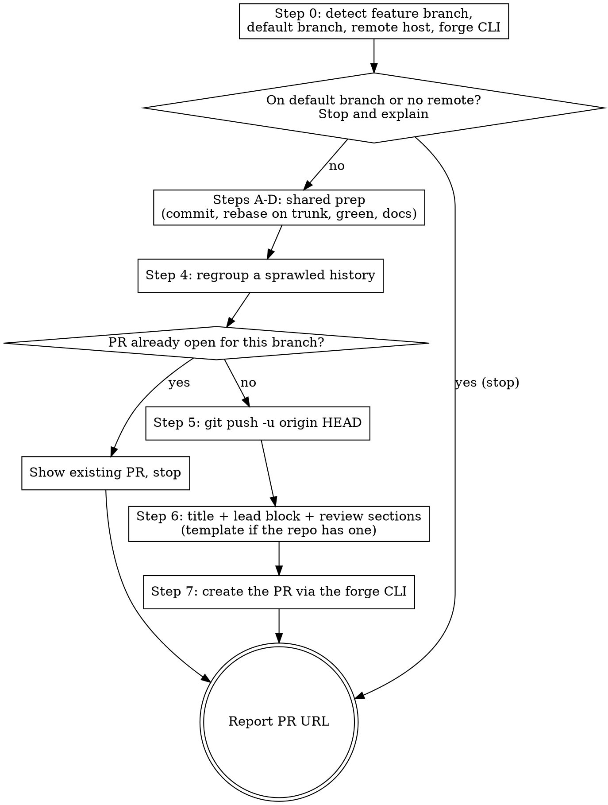

# PR

Open a pull request for the current feature branch. Make sure that the branch is
committed and green, push it, and open a PR whose title and description are the
future squash commit.

## Guardrails

- Push the feature branch only. The request for a PR authorizes that push.
  Never push the trunk, and never merge anything.
- The title and the lead block of the description become the squash commit.
  They land in `git log` byte for byte, so write them under the same rules as
  every commit. Step 6 gives the rules.
- Every claim in the description must be true of this branch and visible in
  the diff. No future work, no open questions, no speculation.
- If the repo ships a PR template, fill its structure instead of the default
  shape.
- Open the PR ready for review. Make it a draft only when the user asks.

## Workflow


```dot
digraph pr {
  rankdir=TB; node [shape=box];
  detect   [label="Step 0: detect feature branch,\ndefault branch, remote host, forge CLI"];
  refuse   [label="On default branch or no remote?\nStop and explain" shape=diamond];
  prep     [label="Steps A-D: shared prep\n(commit, rebase on trunk, green, docs)"];
  regroup  [label="Step 4: regroup a sprawled history"];
  exists   [label="PR already open for this branch?" shape=diamond];
  show     [label="Show existing PR, stop"];
  push     [label="Step 5: git push -u origin HEAD"];
  body     [label="Step 6: title + lead block + review sections\n(template if the repo has one)"];
  create   [label="Step 7: create the PR via the forge CLI"];
  done     [label="Report PR URL" shape=doublecircle];

  detect -> refuse;
  refuse -> done [label="yes (stop)"];
  refuse -> prep [label="no"];
  prep -> regroup -> exists;
  exists -> show [label="yes"];
  show -> done;
  exists -> push [label="no"];
  push -> body -> create -> done;
}
```

### Step 0: Detect the situation

```bash
git branch --show-current                                      # the branch to PR
git remote get-url origin                                      # the remote host
git symbolic-ref --short refs/remotes/origin/HEAD 2>/dev/null  # origin/main, the base
```

- The default branch is the PR base. Strip the `origin/` prefix. If the ref is
  missing, run `git remote set-head origin --auto` and read it again.
- If the current branch is the default branch, stop. A PR opens from a feature
  branch.
- If there is no remote, stop and say so.
- Pick the forge CLI that matches the remote host, and use it for every PR
  operation:
  - github.com or GitHub Enterprise: `gh`
  - Gitea or Forgejo: `tea`
  - gitlab.com or self-hosted GitLab: `glab`
  - A self-hosted host you cannot identify by name: the CLI whose configured
    logins include that host (`tea login list`, `glab auth status`,
    `gh auth status`)
- If the matching CLI is not installed or not authenticated for the host, stop.
  Ask the user to install it or log in (`gh auth login`, `tea login add`,
  `glab auth login`). Do not fall back to another forge's CLI.

#### Commands per forge

`<base>` is the default branch, `<branch>` the feature branch, and
`<body-file>` the temp file that holds the description.

| Operation              | GitHub (`gh`)                                                                          | Gitea / Forgejo (`tea`)                                                                            | GitLab (`glab`)                                                                                                            |
| ---------------------- | -------------------------------------------------------------------------------------- | -------------------------------------------------------------------------------------------------- | -------------------------------------------------------------------------------------------------------------------------- |
| Existing PR for branch | `gh pr view --json url,state -q '.url + " (" + .state + ")"'`                          | `tea pr ls --head <branch> --output json --fields index,url,state`                                 | `glab mr list --source-branch <branch>`                                                                                    |
| Create PR (ready)      | `gh pr create --base <base> --head <branch> --title "<title>" --body-file <body-file>` | `tea pr create --base <base> --head <branch> --title "<title>" --description "$(cat <body-file>)"` | `glab mr create --target-branch <base> --source-branch <branch> --title "<title>" --description "$(cat <body-file>)" --yes` |
| Open as draft (opt-in) | add `--draft`                                                                          | append ` [WIP]` to the title (tea has no draft flag)                                               | add `--draft`                                                                                                              |

- `tea` and `glab` take the body inline through `--description`. Write the body
  to the temp file first, then pass `"$(cat <body-file>)"`.
- `tea` has no draft flag. A Gitea draft is a title prefixed with `[WIP]`.
- `glab mr create` is interactive by default. Pass `--yes`.

### Steps A to D: Prepare the branch

Read `../shared/finishing-prep.md` (relative to this skill's base directory) and
do every step in it. The PR merges into the remote trunk, so pass:

- `<rebase-onto>` = `origin/<default-branch>`

Return here when it is done.

### Step 4: Regroup a sprawled history

A few coherent commits review better than a trail of small or fixup commits.
Record the tip, then run the shared regroup procedure:

```bash
orig=$(git rev-parse HEAD)   # tip before any rewrite, for the byte-identical check
```

Read `../shared/regroup-history.md` (relative to this skill's base directory)
and do every step in it, with:

- `<base>` = the default branch (the trunk from Step B)
- `<original-tip>` = `$orig`

The procedure leaves a clean branch untouched, rebuilds a sprawled one, proves
the tree is byte-for-byte identical, and runs the project's full gate once at
the end. If that gate is red, do not open the PR. The tree is unchanged, so
report the failures and stop.

### Step 5: Push the branch

Run the "Existing PR for branch" command for your forge. If a PR is already
open, show its URL and stop. Offer to update it instead.

Otherwise push:

```bash
git push -u origin HEAD
```

If the push is rejected as non-fast-forward, the branch was pushed before the
Step B rebase rewrote it. Reconciling that needs a force push, which the
`enforce_branch_protection` hook blocks. Do not try to force it. Ask the user to
run `! git push --force-with-lease`, then continue.

### Step 6: Write the title and the description

Read the whole branch. The diff is the ground truth:

```bash
git log --oneline <default-branch>..HEAD
git diff <default-branch>...HEAD
```

Then look for a PR template. Use the first path that exists:

```bash
# directory of named templates (GitHub/Gitea/Forgejo, then GitLab)
ls .github/PULL_REQUEST_TEMPLATE/ .gitea/PULL_REQUEST_TEMPLATE/ \
   .forgejo/PULL_REQUEST_TEMPLATE/ .gitlab/merge_request_templates/ 2>/dev/null
# single-file templates across forges
ls .github/PULL_REQUEST_TEMPLATE.md .github/pull_request_template.md \
   .gitea/PULL_REQUEST_TEMPLATE.md .gitea/pull_request_template.md \
   .forgejo/PULL_REQUEST_TEMPLATE.md \
   docs/pull_request_template.md PULL_REQUEST_TEMPLATE.md 2>/dev/null
```

- A directory of templates: use `default.md` if present. Otherwise ask the
  user which one to use.
- A single file: that file is the body skeleton. Keep every heading in its
  order. Fill each section truthfully. Mark a section that does not apply
  `N/A` rather than invent content.
- No template: use the shape below.

#### Title

The title is the squash commit subject: `<type>(<scope>): <subject>`,
imperative, lowercase subject, at most 70 characters. The type comes from
`build ci docs feat fix perf refactor style test`. There is no `chore`. Frame
the subject for a reader of the merged history. Add `!` before the colon when
the branch is breaking.

#### Lead block

The lead block is everything above the first markdown heading. It becomes the
squash commit body. Write one to three sentences that say what the change is
and what it does. Wrap at 72 characters. Put a blank line between paragraphs.
No headings, checklists, or bullet lists.

- Name the feature, command, flag, or behavior, and say what it does. "Adds
  `--dry-run` to `prune`, which reports what would be deleted and exits without
  touching the destination" names the change. A description of the state the
  branch leaves behind does not.
- One idea per sentence. Detail that piles up belongs in `## Changes`.
- Give the motivation as a clause, and only where the change reads as
  arbitrary without it. That is usually a fix, where the failure mode is the
  point. Do not open with a paragraph that establishes the feature was
  missing.
- Synthesize the whole branch. Never paste a commit body, and never write a
  paragraph per commit.

#### Breaking changes

A breaking change takes both markers: `!` before the colon in the title, and a
`BREAKING CHANGE: <impact and migration>` paragraph as the last paragraph of the
lead block. One marker without the other is malformed.

The PR inherits every break on the branch. The squash leaves the title and the
lead block as the only place a break can land. Scan the commits:

```bash
git log <default-branch>..HEAD --format='%s' | grep -E '^[a-z]+(\([^)]*\))?!:'
git log <default-branch>..HEAD --format='%B' | grep -F 'BREAKING CHANGE'
```

A hit in either means the PR is breaking. Merge several breaks into one footer.
No hit does not settle it, so judge the diff too. A changed exit code, a removed
or renamed flag, a new required argument, or a changed default that alters
output is a break, whether or not a commit said so. Prose about a break under a
`##` section never replaces the markers.

#### Review sections

After the lead block, add `##` sections that carry the detail the lead block
left out. They stay with the PR and are not squashed. They must not restate the
lead block.

- `## Changes`: the concrete changes, grouped by what changed for a user of the
  code, not by commit. Flag names, API surfaces, and mechanics go here. Also
  list behavior changes for existing users that break no contract, such as a
  widened timeout, a new skip condition, or a changed default. Write this
  section unless the branch is a one-liner.
- `## Testing`: manual verification that a reviewer cannot reproduce from CI,
  plus one pass/fail line for the suite. Do not narrate how thoroughly you
  tested.

An example that shows the altitude of each layer:

```text
Adds S3 authentication through the host's ambient credentials, so a
container can authenticate with an EC2 instance profile, EKS IRSA, or
an ECS task role instead of an explicit key pair. Makes a destination
ezbak cannot read a failure rather than an empty result.

BREAKING CHANGE: a pre-start restore that hit a transient S3 error
used to exit 0; it now exits 1 and blocks the job from starting.

## Changes

- Credentials are optional. Omitting both defers to boto3's provider
  chain: instance profile, IRSA, ECS task role, `AWS_*`, `~/.aws`.
- `EZBak.unreadable_locations` reports which destinations could not be
  read, so a caller can tell a partial inventory from a complete one.
- The bucket check uses `HeadBucket` instead of `GetBucketLocation`.
```

### Step 7: Create the PR

Write the body to a temp file to avoid shell quoting problems, then run the
"Create PR" command for your forge:

```bash
cat > /tmp/pr-body.md <<'EOF'
<one to three sentences: what this change is and what it does, wrapped at 72 chars>

BREAKING CHANGE: <footer, only when the title has `!`>

## Changes

- <the concrete changes; review-only sections from here down, never squashed>
EOF

# GitHub example. Substitute the row for your detected CLI.
gh pr create --base <default-branch> --head "$(git branch --show-current)" \
  --title "<type>(<scope>): <subject>" --body-file /tmp/pr-body.md
```

Add `--draft` (`gh`, `glab`) or a `[WIP]` title prefix (`tea`) only when the
user asked for a draft.

Report the PR URL. State that the feature branch was pushed and the trunk was
untouched. The merge is the user's or a reviewer's call.

## Failure modes

| Symptom                                          | Cause                                                      | Do this                                                                                       |
| ------------------------------------------------ | ---------------------------------------------------------- | --------------------------------------------------------------------------------------------- |
| Title rejected                                   | Not a valid conventional commit                            | Fix the title. `chore` is not an allowed type                                                 |
| Push rejected (non-fast-forward)                 | Branch was pushed before the Step B rebase                 | Do not force. Ask the user to run `! git push --force-with-lease`                             |
| A `pre-commit` hook fails or reformats in Step 4 | A group commit staged only part of the tree                | Commit each group with `--no-verify`. The full gate runs once at the end                      |
| Step 4's closing gate is red                     | Pre-existing breakage. The regroup left the tree unchanged | Report it and stop. Do not open the PR and do not amend the group commits                     |
| "a pull request already exists"                  | Branch already has an open PR                              | Show the existing PR. Offer to update it                                                      |
| `tea` or `glab` opens an editor or hangs         | Body or title not passed non-interactively                 | Pass `--description "$(cat <body-file>)"`, and `--yes` for `glab`. `tea` has no `--body-file` |
| Forge CLI not found or not authenticated         | Matching CLI missing or not logged in for the host         | Stop. Ask the user to install and authenticate it                                             |
| Title has `!` but no footer, or the reverse      | Breaking marker applied in only one place                  | Add the missing marker, or drop both when the branch is not breaking                          |
| Lead block reads like a design doc               | Future work, open questions, or speculation included       | Cut it. Keep what the change is and does, plus the footer when breaking                       |
| Lead block matches a commit body                 | Promoted the dominant commit instead of the branch         | Rewrite from `git diff <base>...HEAD` at branch altitude                                      |
| Template has sections you cannot fill            | Template asks for content not true of this branch          | Mark those sections `N/A`. Never invent prose                                                 |
