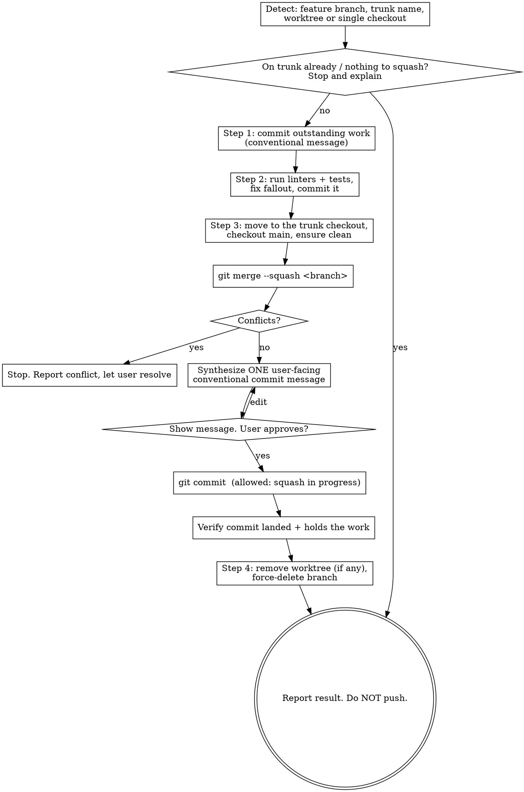

# Squash

Collapse a completed feature branch (or its worktree) into a single commit on
the local `main`/`master` branch, then clean up. This is the end-of-feature
"land it" workflow: one tidy commit on the trunk, no leftover branch.

This skill is **destructive and irreversible** once the deletions run. Force
through nothing — confirm the message, verify the commit landed, then clean up.

## Non-negotiable guardrails

- **Never push.** The squash lands on the _local_ trunk only. Stop after
  cleanup and let the user push when they're ready.
- **The final commit message is for an end user, not a maintainer.** It
  describes the branch as one shipped feature and why the project's users
  benefit — not a changelog of every internal change. Synthesize it, show it,
  commit only on approval.
- **Verify before you delete.** Confirm the squash commit exists and holds the
  work _before_ removing any branch or worktree. Deletions are the last steps.
- **Conventional commits throughout.** Every commit this skill makes (any
  pre-squash cleanup commits and the final squash commit) must be a valid
  conventional commit: `<type>(<scope>): <subject>`, imperative,
  lowercase subject, ≤70-char header, type from the allowed set
  (`build ci docs feat fix perf refactor style test` — note there is no
  `chore`). The `enforce_commit_message` hook will reject anything else.

## Why this works with branch protection

This repo's `enforce_branch_protection` hook blocks commits directly on
`main`/`master` — **except** when a squash merge is in progress (it detects
`SQUASH_MSG` in the git dir, or a `git merge --squash ... && git commit` chain).
That carve-out exists for exactly this workflow. So the final commit _must_ go
through `git merge --squash` followed by `git commit`. Do not try to commit on
the trunk any other way; it will be blocked.

## Workflow



### Step 0 — Detect the situation

Establish four facts before touching anything:

```bash
git branch --show-current                 # the feature branch to squash
git rev-parse --git-dir                    # differs from below inside a worktree
git rev-parse --git-common-dir             # points at the real .git
git worktree list                          # shows every checkout + its branch
```

- **Trunk name**: prefer `main`; use `master` if that's what exists
  (`git rev-parse --verify main` / `master`).
- **Worktree vs single checkout**: if `--git-dir` and `--git-common-dir` resolve
  to different paths, you are in a _linked worktree_; the trunk lives in a
  separate checkout (find it in `git worktree list` — it's the one on
  `main`/`master`). Otherwise it's a single checkout and you'll switch it to the
  trunk yourself.

**Refuse early** if: the current branch is already `main`/`master` (nothing to
land), or the branch has no commits beyond the trunk (nothing to squash). Say so
and stop.

### Step 1 — Commit outstanding work

`git merge --squash` only carries _committed_ history, so any uncommitted work
must be committed onto the feature branch first.

```bash
git status --porcelain    # anything here must be committed
```

If dirty, stage and commit with a real conventional message describing the
changes (it gets squashed away, but it still must pass the commit hook):

```bash
git add -A
git commit -m "<type>(<scope>): <subject>"
```

If the tree is already clean, skip this step.

### Step 2 — Get the branch green

Land only work that passes the project's own gates. Run every linter and test
suite the project defines, fix whatever they flag, and commit the fixes onto the
feature branch so they're part of what gets squashed.

```bash
# Use the project's actual tooling — discover it, don't assume. For this repo:
uv run ruff check . && uv run ruff format . && uv run ty check
uv run pytest
```

Other projects may use `npm test`, `make lint`, `pre-commit run --all-files`,
etc. — read the repo's config (`pyproject.toml`, `package.json`, `Makefile`,
CI workflows) to find the real commands rather than guessing.

If anything fails, fix it and re-run until clean. Then commit the cleanup with a
conventional message:

```bash
git add -A
git commit -m "<type>(<scope>): <subject>"
```

If everything already passes and nothing changed, there's nothing to commit —
move on. **Do not proceed to the squash with failing linters or tests**; landing
broken work on the trunk is exactly what this step prevents.

### Step 3 - Review and update documentation

Review any project documentation and make updates as needed to avoid documentation drift. This includes the README, CONTRIBUTING, and any other documentation that is relevant to the changes. If the `documentation-writer` skill is available, use it to review and update the documentation.

If you made any updates to the documentation, commit the changes with a conventional message describing the changes:

```bash
git add -A
git commit -m "<type>(<scope>): <subject>"
```

### Step 4 — Squash onto the trunk

Get onto the trunk checkout, confirm it's clean, then squash-merge the branch.

- **Single checkout**: `git checkout main` in the current repo.
- **Worktree**: `cd` into the trunk's checkout (from `git worktree list`); it's
  already on `main`. Confirm with `git status` that the trunk tree is clean
  before merging — a dirty trunk means stop and ask the user.

```bash
git merge --squash <feature-branch>
```

This stages every change from the branch as _uncommitted_ work and writes
`SQUASH_MSG`. **If it reports conflicts, stop** — report which files conflict and
let the user resolve; do not guess at resolutions or abort their work.

Now write the final commit message. Read the branch's contribution for context,
but the message is **not** a changelog of it:

```bash
git log --oneline main..<feature-branch>   # context: the commits being collapsed
git diff --staged --stat                    # context: the net change landing on trunk
```

Describe the branch as **one feature, framed for an end user of the project** —
what they can now do and why it benefits them — not an inventory of every
internal change. The reader is someone scanning the trunk's history or a release
changelog, so reference the public-facing capability, not internal class names,
refactors, or intermediate commits. A branch with fifteen commits across five
files should still land as a single, coherent "here's what shipped and why"
message. Drop the incidental churn (test tweaks, lint fixes, renames) unless it
_is_ the user-facing point.

Draft one conventional commit (subject + body explaining the _why_ for the
user), **show it to the user, and commit only once they approve** (edit and
re-show on request):

```bash
git commit -m "<type>(<scope>): <subject>" -m "<body>"
```

The branch-protection hook permits this commit because the squash merge is in
progress. Validate it landed before going further:

```bash
git log -1 --stat        # confirm the squash commit exists and holds the work
```

### Step 5 — Clean up

Only after the commit is verified. Squash merges leave **no merge ancestry**, so
git does not consider the branch merged — `git branch -d` will fail with "not
fully merged". Use `-D` (force). This is safe and _not_ blocked by the hook,
which only protects `main`/`master` from force-deletion.

Order matters: a branch checked out in a worktree can't be deleted, so remove
the worktree first.

```bash
# Worktree case only — frees the branch. Never rm -rf the directory by hand;
# let git remove it so its metadata is cleaned up too.
git worktree remove <worktree-path>

# Both cases — force-delete because the squash left no merge ancestry.
git branch -D <feature-branch>
```

If `git worktree remove` complains about untracked or dirty files, **stop and
report** rather than forcing — forcing would silently discard those files.

### Finish

Summarize what happened: the single squash commit (hash + subject) now on the
local trunk, the branch deleted, the worktree removed. Remind the user the trunk
is **not pushed** — that's theirs to do.

## Common failure modes

| Symptom                             | Cause                                         | Do this                                                                        |
| ----------------------------------- | --------------------------------------------- | ------------------------------------------------------------------------------ |
| Commit on trunk blocked             | Committed without an in-progress squash merge | Use `git merge --squash` then `git commit`; never commit on the trunk directly |
| `branch -d` says "not fully merged" | Squash merge records no merge ancestry        | Use `git branch -D` (expected, not an error)                                   |
| `worktree remove` refuses           | Untracked/dirty files in the worktree         | Stop, show the user; don't force-discard their files                           |
| Merge conflict on squash            | Trunk diverged from the branch's base         | Stop; let the user resolve, then resume at the commit step                     |
| Commit rejected by hook             | Message isn't a valid conventional commit     | Fix the type/subject; `chore` is not an allowed type here                      |
