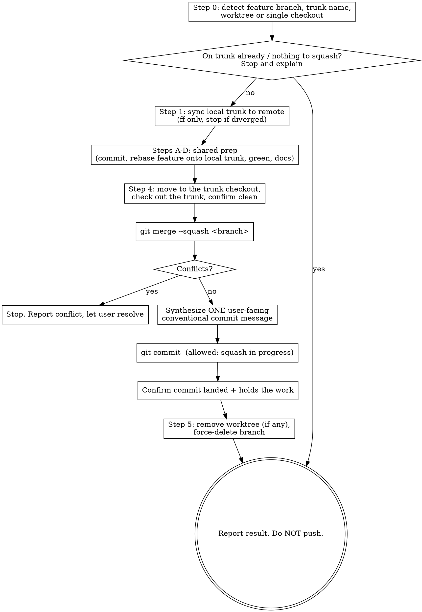

# Squash

Collapse a completed feature branch (or its worktree) into a single commit on
the local `main`/`master` branch, then clean up. This is the end-of-feature
"land it" workflow: one tidy commit on the trunk, no leftover branch.

This skill is **destructive and irreversible** once the deletions run. Force
nothing. Synthesize the message, then confirm the commit landed before you clean
up.

## Non-negotiable guardrails

- **Never push.** The squash lands on the _local_ trunk only. Stop after
  cleanup and let the user push when they are ready.
- **The final commit message is for an end user, not a maintainer.** It
  describes the branch as one shipped feature and why the project's users
  benefit, not as a changelog of every internal change. Synthesize it, commit it
  directly (no approval prompt), and report the message used.
- **Confirm before you delete.** Confirm that the squash commit exists and holds
  the work _before_ you remove any branch or worktree. Deletions are the last
  steps.
- **Conventional commits throughout.** Every commit this skill makes, the prep
  commits and the final squash commit alike, must be a valid conventional commit
  (full rule in the shared prep reference below). The `enforce_commit_message`
  hook rejects anything else.

## Why this works with branch protection

The `enforce_branch_protection` hook blocks commits directly on `main`/`master`,
**except** when a squash merge is in progress. It detects `SQUASH_MSG` in the git
dir, or a `git merge --squash ... && git commit` chain. That carve-out exists for
exactly this workflow, so the final commit **must** go through
`git merge --squash` followed by `git commit`. Do not try to commit on the trunk
any other way. The hook blocks it.

## Workflow


```dot
digraph squash {
  rankdir=TB; node [shape=box];
  detect   [label="Step 0: detect feature branch, trunk name,\nworktree or single checkout"];
  refuse   [label="On trunk already / nothing to squash?\nStop and explain" shape=diamond];
  sync     [label="Step 1: sync local trunk to remote\n(ff-only, stop if diverged)"];
  prep     [label="Steps A-D: shared prep\n(commit, rebase feature onto local trunk, green, docs)"];
  goto     [label="Step 4: move to the trunk checkout,\ncheck out the trunk, confirm clean"];
  squash   [label="git merge --squash <branch>"];
  conflict [label="Conflicts?" shape=diamond];
  resolve  [label="Stop. Report conflict, let user resolve"];
  msg      [label="Synthesize ONE user-facing\nconventional commit message"];
  commit2  [label="git commit  (allowed: squash in progress)"];
  verify   [label="Confirm commit landed + holds the work"];
  cleanup  [label="Step 5: remove worktree (if any),\nforce-delete branch"];
  done     [label="Report result. Do NOT push." shape=doublecircle];

  detect -> refuse;
  refuse -> done [label="yes"];
  refuse -> sync [label="no"];
  sync -> prep -> goto -> squash -> conflict;
  conflict -> resolve [label="yes"];
  conflict -> msg [label="no"];
  msg -> commit2;
  commit2 -> verify -> cleanup -> done;
}
```

### Step 0 - Detect the situation

Establish the situation before you touch anything:

```bash
git branch --show-current                 # the feature branch to squash
git rev-parse --git-dir                    # differs from below inside a worktree
git rev-parse --git-common-dir             # points at the real .git
git worktree list                          # shows every checkout + its branch
```

- **Trunk name**: prefer `main`. Use `master` when that is the branch that
  exists (`git rev-parse --verify main` / `master`).
- **Worktree vs single checkout**: when `--git-dir` and `--git-common-dir`
  resolve to different paths, you are in a _linked worktree_, and the trunk
  lives in a separate checkout. Find it in `git worktree list`, where it is the
  checkout on `main`/`master`. If no checkout is on the trunk, stop and report.
  Otherwise this is a single checkout, and you switch it to the trunk yourself.

**Refuse early** if either:

- the current branch is already `main`/`master` (nothing to land), or
- the branch has no commits beyond the trunk **and** the working tree is clean
  (truly nothing to squash).

A branch that is level with the trunk but has _uncommitted_ changes is **not** a
refusal. The shared prep commits that work onto the branch, and one commit then
remains to squash. Run `git status --porcelain` before you refuse on the second
condition. If it prints anything, there is work to squash, so proceed.

### Step 1 - Sync the local trunk

The squash lands on the **local** trunk (Step 4), which can be _ahead_ of its
remote (prior unpushed squashes) or _behind_ it (the remote advanced). Bring the
local trunk current with the remote before the shared prep runs. The feature then
rebases onto the exact commit it will land on, so any conflict surfaces during
prep instead of mid-squash. Skip this whole step on a local-only repo (no
remote).

```bash
git fetch --all --prune
```

Fast-forward the local trunk to the remote without rewinding a locally-ahead
trunk or forcing a divergence. The mechanics differ by the layout detected in
Step 0.

- **Single checkout**: you are on the feature branch, the trunk is not checked
  out, and the tree can still be dirty because Step A has not run yet. Update the
  trunk ref only when the remote is strictly ahead:

  ```bash
  ahead=$(git rev-list --count origin/<trunk>..<trunk>)    # local-only commits
  behind=$(git rev-list --count <trunk>..origin/<trunk>)   # remote-only commits
  if [ "$behind" -gt 0 ] && [ "$ahead" -gt 0 ]; then
      echo "DIVERGED: both sides have unique commits"      # STOP and report, never force
  elif [ "$behind" -gt 0 ]; then
      git fetch . origin/<trunk>:<trunk>                   # remote strictly ahead, fast-forward
  fi
  # ahead-only or equal: nothing to do, the local trunk already contains the remote
  ```

- **Worktree**: the trunk is checked out in another worktree, found in Step 0.
  Fast-forward it in place:

  ```bash
  # ahead: no-op. behind: fast-forwards. diverged: fails, so stop.
  git -C <trunk-checkout> merge --ff-only origin/<trunk>
  ```

If either form reports divergence, **stop and report**. Do not force it.

### Steps A-D - Prepare the branch (shared)

**Read `../shared/finishing-prep.md`** (relative to this skill's base directory)
and perform every step in it before you continue. Every commit it makes goes onto
the _feature branch_, never the trunk. The squash lands on the local trunk you
synced in Step 1, so that prep's Step B rebases onto it:

- **`<rebase-onto>`** = the **local** `<trunk>` branch, not `origin/<trunk>`. It
  is the exact commit the squash will land on.

Return here once it is done.

### Step 4 - Squash onto the trunk

Get onto the trunk checkout, confirm that it is clean, then squash-merge the
branch.

- **Single checkout**: run `git checkout <trunk>` in the current repo.
- **Worktree**: `cd` into the trunk's checkout, the one you found in
  `git worktree list`. It is already on the trunk. Confirm with `git status` that
  the trunk tree is clean before you merge. A dirty trunk means stop and ask the
  user.

On a remote-backed repo, confirm that the trunk is still current as a cheap
safety net before the squash. Skip this on a local-only repo:

```bash
git merge --ff-only origin/<trunk>    # expected: "Already up to date"
```

If this reports that the trunk is behind or diverged, the remote moved since
Step 1. **Stop and report** rather than forcing it, then restart from Step 1.

```bash
git merge --squash <feature-branch>
```

This stages every change from the branch as _uncommitted_ work and writes
`SQUASH_MSG`. **If it reports conflicts, stop.** Report which files conflict and
let the user resolve them. Do not guess at resolutions or abort their work.

Now write the final commit message. Read the branch's contribution for context,
but the message is **not** a changelog of it:

```bash
git log --oneline <trunk>..<feature-branch>   # context: the commits being collapsed
git diff --staged --stat                      # context: the net change landing on trunk
```

Describe the branch as **one feature, framed for an end user of the project**:
what they can do with it, and why it benefits them. The reader is someone who
scans the trunk's history or a release changelog, so name the public-facing
capability rather than internal class names, refactors, or intermediate commits.
A branch with fifteen commits across five files must still land as one coherent
message about what shipped and why. Drop the incidental churn (test tweaks, lint
fixes, renames) unless it _is_ the user-facing point.

Draft one conventional commit, with a subject and a body that gives the reason
for the change. Commit it directly and **do not pause for approval**. Report the
message you used as part of the final summary:

```bash
git commit -m "<type>(<scope>): <subject>" -m "<body>"
```

The branch-protection hook permits this commit because the squash merge is in
progress. Confirm that it landed before you go further:

```bash
git log -1 --stat        # confirm the squash commit exists and holds the work
```

### Step 5 - Clean up

Do this only after you confirm the commit. Squash merges leave **no merge
ancestry**, so git does not consider the branch merged and `git branch -d` fails
with "not fully merged". Use `-D` (force). This is safe, and the hook does not
block it, because the hook only protects `main`/`master` from force-deletion.

Order matters. A branch checked out in a worktree cannot be deleted, so remove
the worktree first.

```bash
# Worktree case only, and it frees the branch. Never rm -rf the directory by
# hand. Let git remove it so its metadata is cleaned up too.
git worktree remove <worktree-path>

# Both cases. Force-delete because the squash left no merge ancestry.
git branch -D <feature-branch>
```

If `git worktree remove` complains about untracked or dirty files, **stop and
report** rather than forcing. Forcing silently discards those files.

### Finish

Summarize what happened: the single squash commit (hash and subject) on the local
trunk, the branch deleted, the worktree removed. Remind the user that the trunk
is **not pushed**. That is theirs to do.

## Common failure modes

| Symptom                             | Cause                                         | Do this                                                                        |
| ----------------------------------- | --------------------------------------------- | ------------------------------------------------------------------------------ |
| Commit on trunk blocked             | Committed without an in-progress squash merge | Use `git merge --squash`, then `git commit`. Never commit on the trunk directly |
| `branch -d` says "not fully merged" | Squash merge records no merge ancestry        | Use `git branch -D`. This is expected, not an error                            |
| `worktree remove` refuses           | Untracked or dirty files in the worktree      | Stop and show the user. Do not force-discard their files                       |
| Merge conflict on squash            | Trunk diverged from the branch's base         | Stop. Let the user resolve it, then resume at the commit step                   |
| Commit rejected by hook             | Message is not a valid conventional commit    | Fix the type or the subject. `chore` is not an allowed type here               |
| A git `pre-commit` hook reformats files on the squash commit | Formatter rewrote the staged tree | Re-stage and re-commit. The squash is still in progress, so the commit is still permitted. Never use `--no-verify` here, because this commit stages the whole tree |
