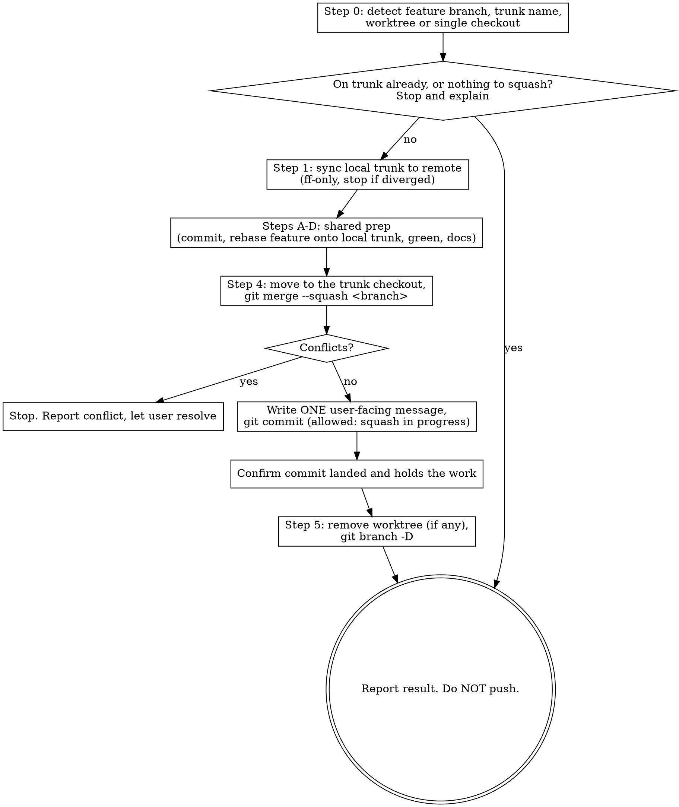

# Squash

Collapse a completed feature branch (or its worktree) into a single commit on
the local `main` or `master` branch, then clean up. This skill is destructive
and irreversible once the deletions run.

## Guardrails

- Never push. The squash lands on the local trunk only. Stop after cleanup and
  let the user push.
- The squash commit message is for an end user, not a maintainer. It describes
  the branch as one shipped feature and how the project's users benefit. Write
  it, commit it without an approval pause, and report the message you used.
- Confirm that the squash commit exists and holds the work before you delete
  any branch or worktree.
- Every commit this skill makes must be a valid conventional commit. The
  `enforce_commit_message` hook rejects anything else.

## Why this works with branch protection

The `enforce_branch_protection` hook blocks commits on `main` and `master`
except while a squash merge is in progress. It detects `SQUASH_MSG` in the git
dir, or a `git merge --squash ... && git commit` chain. The final commit must
therefore go through `git merge --squash` followed by `git commit`. Any other
commit on the trunk is blocked.

## Workflow


```dot
digraph squash {
  rankdir=TB; node [shape=box];
  detect   [label="Step 0: detect feature branch, trunk name,\nworktree or single checkout"];
  refuse   [label="On trunk already, or nothing to squash?\nStop and explain" shape=diamond];
  sync     [label="Step 1: sync local trunk to remote\n(ff-only, stop if diverged)"];
  prep     [label="Steps A-D: shared prep\n(commit, rebase feature onto local trunk, green, docs)"];
  goto     [label="Step 4: move to the trunk checkout,\ngit merge --squash <branch>"];
  conflict [label="Conflicts?" shape=diamond];
  resolve  [label="Stop. Report conflict, let user resolve"];
  commit2  [label="Write ONE user-facing message,\ngit commit (allowed: squash in progress)"];
  verify   [label="Confirm commit landed and holds the work"];
  cleanup  [label="Step 5: remove worktree (if any),\ngit branch -D"];
  done     [label="Report result. Do NOT push." shape=doublecircle];

  detect -> refuse;
  refuse -> done [label="yes"];
  refuse -> sync [label="no"];
  sync -> prep -> goto -> conflict;
  conflict -> resolve [label="yes"];
  conflict -> commit2 [label="no"];
  commit2 -> verify -> cleanup -> done;
}
```

### Step 0: Detect the situation

```bash
git branch --show-current       # the feature branch to squash
git rev-parse --git-dir         # differs from the next line inside a worktree
git rev-parse --git-common-dir  # points at the real .git
git worktree list               # every checkout and its branch
```

- Trunk name: `main`, or `master` when that is the branch that exists
  (`git rev-parse --verify main`).
- Layout: when `--git-dir` and `--git-common-dir` resolve to different paths,
  you are in a linked worktree, and the trunk lives in a separate checkout.
  Find it in `git worktree list`. It is the checkout on the trunk. If no
  checkout is on the trunk, stop and report. Otherwise this is a single
  checkout, and you switch it to the trunk yourself in Step 4.

Stop and explain if the current branch is the trunk. Also stop if the branch
has no commits beyond the trunk and `git status --porcelain` prints nothing.
A branch level with the trunk but with uncommitted changes is not a refusal.
The shared prep commits that work, and one commit then remains to squash.

### Step 1: Sync the local trunk

The squash lands on the local trunk, which can be ahead of its remote (prior
unpushed squashes) or behind it. Bring the local trunk current before the prep
rebases the feature onto it, so any conflict surfaces during prep. Skip this
step on a local-only repo.

```bash
git fetch --all --prune
```

Then fast-forward the local trunk without rewinding a locally-ahead trunk. The
mechanics depend on the layout from Step 0.

- Single checkout. The trunk is not checked out, and the tree can still be
  dirty. Update the trunk ref only when the remote is strictly ahead:

  ```bash
  ahead=$(git rev-list --count origin/<trunk>..<trunk>)    # local-only commits
  behind=$(git rev-list --count <trunk>..origin/<trunk>)   # remote-only commits
  if [ "$behind" -gt 0 ] && [ "$ahead" -gt 0 ]; then
      echo "DIVERGED: both sides have unique commits"      # STOP and report, never force
  elif [ "$behind" -gt 0 ]; then
      git fetch . origin/<trunk>:<trunk>                   # remote strictly ahead: fast-forward
  fi
  # ahead-only or equal: nothing to do
  ```

- Worktree. The trunk is checked out in the other worktree. Fast-forward it in
  place:

  ```bash
  git -C <trunk-checkout> merge --ff-only origin/<trunk>   # diverged: fails, so stop
  ```

If either form reports divergence, stop and report. Never force it.

### Steps A to D: Prepare the branch

Read `../shared/finishing-prep.md` (relative to this skill's base directory) and
do every step in it. Every commit it makes goes onto the feature branch. The
squash lands on the local trunk you synced in Step 1, so pass:

- `<rebase-onto>` = the local `<trunk>` branch, not `origin/<trunk>`

Return here when it is done.

### Step 4: Squash onto the trunk

Get onto the trunk checkout:

- Single checkout: `git checkout <trunk>`.
- Worktree: `cd` into the trunk's checkout from `git worktree list`. Run
  `git status` and confirm that the tree is clean. If it is dirty, stop and ask
  the user.

On a remote-backed repo, confirm that the trunk is still current:

```bash
git merge --ff-only origin/<trunk>    # expected: "Already up to date"
```

If this reports that the trunk is behind or diverged, the remote moved since
Step 1. Stop and report, then restart from Step 1.

Now squash-merge the branch:

```bash
git merge --squash <feature-branch>
```

This stages every change from the branch as uncommitted work and writes
`SQUASH_MSG`. If it reports conflicts, stop. Report which files conflict and
let the user resolve them. Do not guess at resolutions.

Read the branch for context:

```bash
git log --oneline <trunk>..<feature-branch>   # the commits being collapsed
git diff --staged --stat                      # the net change landing on the trunk
```

Write one conventional commit that describes the branch as one feature for an
end user of the project: what they can do with it, and why it helps them. The
reader scans the trunk history or a release changelog, so name the public
capability, not internal class names, refactors, or intermediate commits. Drop
incidental churn (test tweaks, lint fixes, renames) unless it is the user-facing
point. The body gives the reason for the change.

Commit it without an approval pause:

```bash
git commit -m "<type>(<scope>): <subject>" -m "<body>"
```

Confirm that it landed:

```bash
git log -1 --stat        # the squash commit exists and holds the work
```

### Step 5: Clean up

Do this only after the commit is confirmed. A squash merge records no merge
ancestry, so `git branch -d` fails with "not fully merged". Use `-D`. The hook
permits it, because it only protects `main` and `master` from force-deletion.

A branch checked out in a worktree cannot be deleted, so remove the worktree
first:

```bash
# Worktree case only. Never rm -rf the directory by hand.
git worktree remove <worktree-path>

# Both cases. Force-delete because the squash left no merge ancestry.
git branch -D <feature-branch>
```

If `git worktree remove` reports untracked or dirty files, stop and report.
Forcing it discards those files.

### Finish

Summarize the squash commit (hash and subject) on the local trunk, the branch
deleted, and the worktree removed. Remind the user that the trunk is not pushed.

## Failure modes

| Symptom                                        | Cause                                         | Do this                                                                                                   |
| ---------------------------------------------- | --------------------------------------------- | --------------------------------------------------------------------------------------------------------- |
| Commit on trunk blocked                        | No squash merge in progress                   | Use `git merge --squash`, then `git commit`. Never commit on the trunk another way                        |
| `branch -d` says "not fully merged"            | Squash merge records no merge ancestry        | Use `git branch -D`. This is expected                                                                     |
| `worktree remove` refuses                      | Untracked or dirty files in the worktree      | Stop and show the user. Do not force-discard their files                                                  |
| Merge conflict on squash                       | Trunk diverged from the branch's base         | Stop. Let the user resolve it, then resume at the commit step                                             |
| Commit rejected by hook                        | Message is not a valid conventional commit    | Fix the type or subject. `chore` is not an allowed type                                                   |
| A `pre-commit` hook reformats the squash commit | A formatter rewrote the staged tree          | Re-stage and re-commit. The squash is still in progress. Never use `--no-verify` on a whole-tree commit   |
