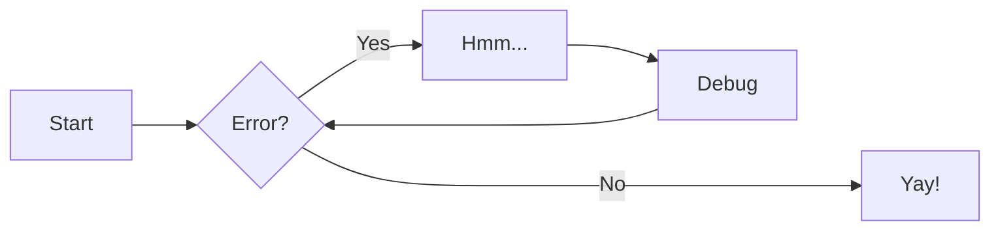
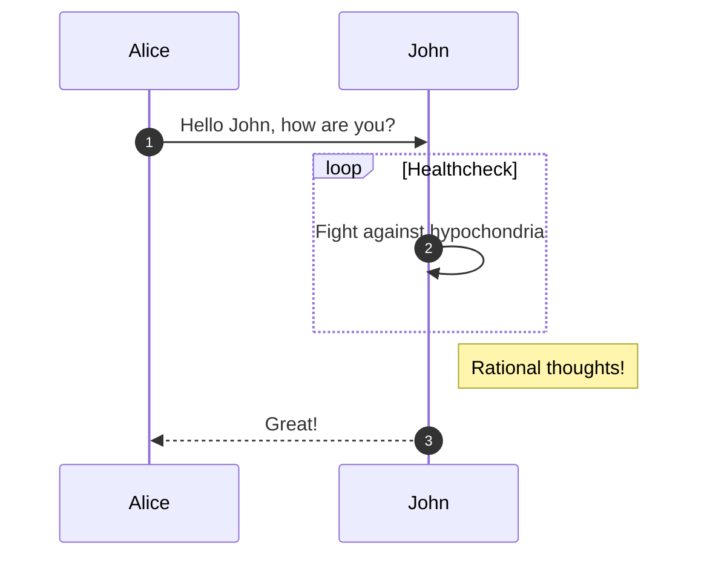
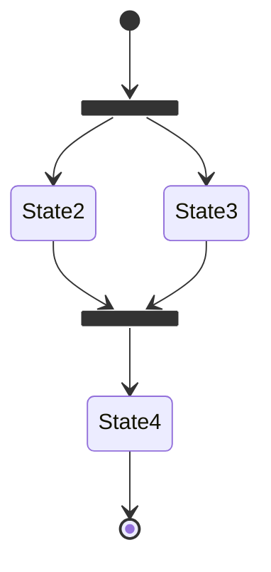
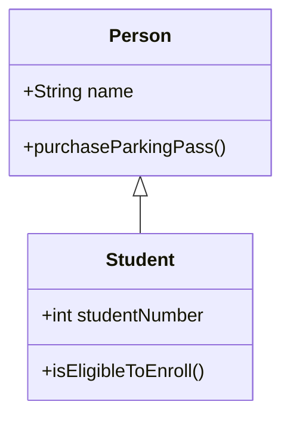
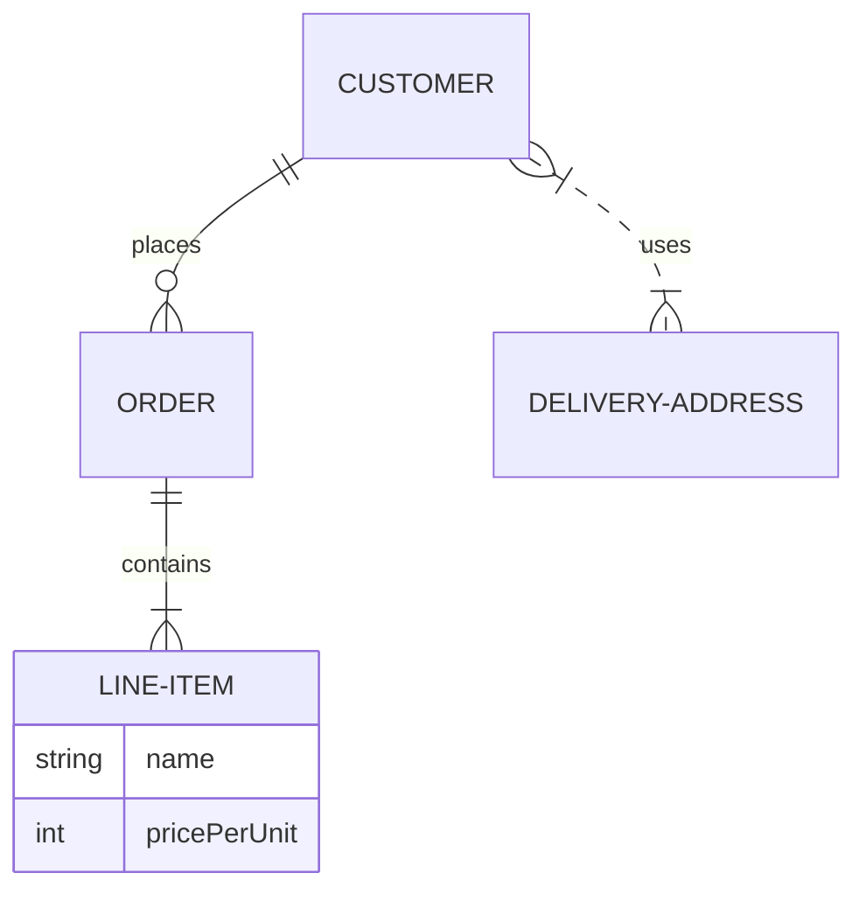

# Zensical authoring reference

Complete syntax for every Markdown feature Zensical supports. Each feature names
the extension(s) that must be enabled (see `configuration.md`); the default set
from `zensical new` already enables everything here except where noted.

**Indentation rule:** Python Markdown requires content nested inside a block
(admonitions, list items with multiple paragraphs, tab bodies, footnotes) to be
indented by **four spaces** (or one tab). Getting this wrong is the most common
authoring bug.

## Table of contents

- [Admonitions (call-outs)](#admonitions-call-outs)
- [Code blocks](#code-blocks)
- [Code annotations](#code-annotations)
- [Content tabs](#content-tabs)
- [Diagrams (Mermaid)](#diagrams-mermaid)
- [Grids and cards](#grids-and-cards)
- [Data tables](#data-tables)
- [Lists](#lists)
- [Formatting (highlight, sub/sup, keys)](#formatting)
- [Icons and emojis](#icons-and-emojis)
- [Buttons](#buttons)
- [Tooltips, abbreviations, glossary](#tooltips-abbreviations-glossary)
- [Footnotes](#footnotes)
- [Images](#images)
- [Math](#math)
- [Page front matter](#page-front-matter)

---

## Admonitions (call-outs)

*Extensions: `admonition`, `pymdownx.details` (collapsible), `pymdownx.superfences` (nesting).*

Side content that doesn't interrupt the document flow. A block starts with `!!!`
followed by a type qualifier; content is indented four spaces.

```markdown
!!! note

    Lorem ipsum dolor sit amet, consectetur adipiscing elit.
```

**Custom title** (any Markdown allowed in the quoted string):

```markdown
!!! note "Phasellus posuere in sem ut cursus"

    Lorem ipsum dolor sit amet.
```

**No title** (empty string; does not work for collapsible blocks):

```markdown
!!! note ""

    Lorem ipsum dolor sit amet.
```

**Collapsible** with `???` (or `???+` to start expanded):

```markdown
??? note

    Collapsed by default; click to expand.

???+ note

    Expanded by default.
```

**Nested** admonitions, indent the inner block a further four spaces:

```markdown
!!! note "Outer Note"

    Outer content.

    !!! note "Inner Note"

        Inner content.
```

**Inline / sidebar** blocks. `inline end` floats right, `inline` floats left.
Must be declared *before* the content block they sit beside:

```markdown
!!! info inline end "Lorem ipsum"

    This sits to the right of the following paragraph.
```

**Supported types** (default is `note`): `note`, `abstract`, `info`, `tip`,
`success`, `question`, `warning`, `failure`, `danger`, `bug`, `example`,
`quote`. Each has a distinct icon.

Pick the type by intent: `warning`/`danger` for pitfalls and data loss, `tip`
for shortcuts, `note`/`info` for asides, `example` for worked samples, `quote`
for citations, `success` for confirmations.

---

## Code blocks

*Extensions: `pymdownx.highlight`, `pymdownx.inlinehilite`, `pymdownx.snippets`, `pymdownx.superfences`.*

Fence with three backticks and a language shortcode ([Pygments lexer
list](https://pygments.org/docs/lexers/)):

````markdown
``` py
import tensorflow as tf
```
````

**Title** (e.g. a filename):

````markdown
``` py title="bubble_sort.py"
def bubble_sort(items):
    ...
```
````

**Line numbers** with `linenums="<start>"` (start can be other than 1):

````markdown
``` py linenums="1"
def bubble_sort(items):
    ...
```
````

**Highlight lines** with `hl_lines` (counts start at 1 regardless of `linenums`).
Space-separate individual lines, use `-` for ranges:

````markdown
``` py hl_lines="2 3"
...
```

``` py hl_lines="3-5"
...
```
````

**Inline highlighted code**, prefix with `#!` + shortcode:

```markdown
The `#!python range()` function generates a sequence of numbers.
```

**Per-block features** via attribute lists (language shortcode comes first,
prefixed with `.`). Enable/disable copy, select, annotate individually:

````markdown
``` { .yaml .copy }
``` { .yaml .no-copy }
``` { .yaml .select }
``` { .yaml .annotate }
````

**Copy button** and **selection button** can be enabled globally as theme
features `content.code.copy` and `content.code.select` (see `configuration.md`).

**Embed external files** (`pymdownx.snippets`) with the `--8<--` notation:

````markdown
``` title=".browserslistrc"
;--8<-- ".browserslistrc"
```
````

---

## Code annotations

*Theme feature `content.code.annotate` (or per-block `.annotate`). Requires Pygments highlighting.*

Attach rich Markdown content to a spot in a code block via a numeric marker
placed inside a comment for that language. The marker is `(N)` and, to strip the
surrounding comment characters, `(N)!`. The annotation body is a numbered list
item after the block, indented and containing any Markdown:

````markdown
``` toml
[project.theme]
features = ["content.code.annotate"] # (1)!
```

1.  :man_raising_hand: I'm a code annotation! I can contain `code`, __formatted
    text__, images, ... basically anything that can be written in Markdown.
````

Annotations go anywhere a comment is legal for the language: `// ...` and
`/* ... */` for JS, `# ...` for YAML/Python/TOML, etc. Stripping (`(1)!`) only
allows a single annotation per comment.

**Annotations in non-comment positions** (e.g. inside JSON strings) require
adding the Pygments lexeme class per language:

```toml
[project.extra.annotate]
json = [".s2"]   # .s2 is Pygments' double-quoted-string token
```

````markdown
``` json
{
  "key": "value (1)"
}
```

1.  Now the annotation can live inside a JSON string.
````

Use annotations to explain a specific token without cluttering the code or
adding a wall of prose beneath it. Great for config files and API examples.

---

## Content tabs

*Extensions: `pymdownx.superfences`, `pymdownx.tabbed` with `alternate_style = true`.*

Group alternative content (per-language examples, per-OS instructions) under
tabs. Each tab is `=== "Label"` with its body indented four spaces.

**Group code blocks:**

````markdown
=== "C"

    ``` c
    #include <stdio.h>
    int main(void) { printf("Hello world!\n"); return 0; }
    ```

=== "C++"

    ``` c++
    #include <iostream>
    int main(void) { std::cout << "Hello world!"; return 0; }
    ```
````

**Group any content** (lists, prose, nested tabs, admonitions):

```markdown
=== "Unordered list"

    * Item one
    * Item two

=== "Ordered list"

    1. Item one
    2. Item two
```

**Nest inside an admonition:**

````markdown
!!! example

    === "Unordered List"

        ``` markdown
        * Item one
        ```

    === "Ordered List"

        ``` markdown
        1. Item one
        ```
````

Anchor links are auto-generated per tab. Enable theme feature
`content.tabs.link` to link all same-labeled tabs site-wide (clicking "macOS"
in one place switches every tab group to "macOS").

Reach for tabs whenever you'd otherwise write "if you use X do this, if you use
Y do that" as parallel prose.

---

## Diagrams (Mermaid)

*Extension: `pymdownx.superfences` with a `mermaid` custom fence (in the defaults).*

Fence a diagram as `mermaid`; Zensical initializes the runtime automatically and
themes it for light/dark and the configured fonts/colors.

**Flowchart:**

````markdown

````

**Sequence diagram:**

````markdown

````

**State diagram:**

````markdown

````

**Class diagram:**

````markdown

````

**Entity-relationship diagram:**

````markdown

````

**Officially themed/supported:** flowcharts, sequence, state, class, and
entity-relationship diagrams. Other Mermaid types (pie, gantt, user journey, git
graph, requirement) render but are not officially supported and tend to read
poorly on mobile, so avoid them.

Use a diagram whenever you're describing a flow, a sequence of interactions, a
state machine, an object model, or a data model. A diagram beats a paragraph for
all of these.

---

## Grids and cards

*Extensions: `attr_list`, `md_in_html`. Icons need the emoji extension too.*

Arrange blocks into a responsive grid, ideal for index/overview pages.

**Card grid, list syntax** (a `div` with classes `grid cards` wrapping a list):

```html
<div class="grid cards" markdown>

- :fontawesome-brands-html5: __HTML__ for content and structure
- :fontawesome-brands-js: __JavaScript__ for interactivity
- :fontawesome-brands-css3: __CSS__ for styling

</div>
```

**Card grid, rich cards** (icon + heading, `---` divider, body, call-to-action
link). Note the `{ .lg .middle }` icon modifiers:

```html
<div class="grid cards" markdown>

-   :material-clock-fast:{ .lg .middle } __Set up in 5 minutes__

    ---

    Install [`zensical`](#) with [`pip`](#) and get up and running in minutes.

    [:octicons-arrow-right-24: Getting started](#)

-   :fontawesome-brands-markdown:{ .lg .middle } __It's just Markdown__

    ---

    Focus on your content and generate a responsive, searchable static site.

    [:octicons-arrow-right-24: Reference](#)

</div>
```

**Card grid, block syntax** (add `{ .card }` to individual blocks so cards can
mix with other grid elements):

```html
<div class="grid" markdown>

:fontawesome-brands-html5: __HTML__ for content and structure
{ .card }

:fontawesome-brands-js: __JavaScript__ for interactivity
{ .card }

> :fontawesome-brands-internet-explorer: __Internet Explorer__ ... huh?

</div>
```

**Generic grid** (arbitrary blocks: admonitions, code blocks, content tabs) via
a `div` with class `grid`:

````html
<div class="grid" markdown>

=== "Unordered list"

    * Item one

=== "Ordered list"

    1. Item one

``` title="Content tabs"
=== "Unordered list"

    * Item one
```

</div>
````

Grids collapse to full-width stacking on narrow viewports automatically.

---

## Data tables

*Extension: `tables` (on by default).*

Standard Markdown tables. Cells accept inline Markdown, code, icons, and emojis:

```markdown
| Method      | Description                          |
| ----------- | ------------------------------------ |
| `GET`       | :lucide-check:       Fetch resource  |
| `PUT`       | :lucide-check-check: Update resource |
| `DELETE`    | :lucide-x:           Delete resource |
```

**Column alignment** via `:` on the divider row: `:---` left, `:---:` center,
`---:` right.

```markdown
| Method      | Description                          |
| :---------- | :----------------------------------: |
```

Sortable tables are possible with the tablesort library plus a little JS (see
the Zensical data-tables guide if needed).

---

## Lists

*Extensions: `def_list` (definition lists), `pymdownx.tasklist` with `custom_checkbox = true` (task lists). Unordered/ordered are core.*

**Unordered** (`-`, `*`, or `+`, interchangeable; nest by indenting):

```markdown
- First item
    * Nested item
    * Nested item
```

**Ordered** (numbers need not be consecutive; all `1.` is fine, they renumber):

```markdown
1.  First item
    1.  Nested item
    2.  Nested item
```

**Definition list** (term, then `:` + four-space-indented definition):

```markdown
`Lorem ipsum dolor sit amet`

:   Definition text here, wrapped across
    multiple lines if needed.

`Cras arcu libero`

:   Another definition.
```

**Task list** (`[ ]` unchecked, `[x]` checked):

```markdown
- [x] Completed task
- [ ] Pending task
    * [x] Completed subtask
    * [ ] Pending subtask
```

---

## Formatting

*Extensions: `pymdownx.caret`, `pymdownx.keys`, `pymdownx.mark`, `pymdownx.tilde`.*

**Highlight / underline / strikethrough:**

```markdown
- ==This was marked (highlight)==
- ^^This was inserted (underline)^^
- ~~This was deleted (strikethrough)~~
```

**Sub- and superscript:**

```markdown
- H~2~O
- A^T^A
```

**Keyboard keys:**

```markdown
++ctrl+alt+del++
```

---

## Icons and emojis

*Extensions: `attr_list`, `pymdownx.emoji`.*

Over 10,000 icons and thousands of emojis via `:shortcode:` between colons.

**Emoji** (look up shortcodes on Emojipedia):

```markdown
:smile:
```

**Icon**, reference a path in a bundled set, replacing `/` with `-`:

```markdown
:fontawesome-regular-face-laugh-wink:
```

Bundled icon sets: Lucide (`:simple-lucide:`), Material Design
(`:material-material-design:`), FontAwesome
(`:fontawesome-brands-font-awesome:`), Octicons (`:octicons-mark-github-16:`),
Simple Icons (`:simple-simpleicons:`).

**Colored / styled icon** via a CSS class from an additional stylesheet
(`attr_list`):

```markdown
:fontawesome-brands-youtube:{ .youtube }
```

Icons also take size/position modifiers like `{ .lg .middle }` (used in cards)
and a `title` attribute for a tooltip (see below).

---

## Buttons

*Extension: `attr_list`.*

Turn any link into a button by suffixing it with the `.md-button` class:

```markdown
[Subscribe to our newsletter](#){ .md-button }
```

**Primary (filled) button** adds `.md-button--primary`:

```markdown
[Subscribe to our newsletter](#){ .md-button .md-button--primary }
```

**Button with icon:**

```markdown
[Send :fontawesome-solid-paper-plane:](#){ .md-button }
```

Use buttons for call-to-actions on landing/index pages, not for routine inline
links.

---

## Tooltips, abbreviations, glossary

*Extensions: `abbr`, `attr_list`, `pymdownx.snippets`. Theme feature `content.tooltips` for improved tooltips.*

**Link tooltip** via the standard Markdown link title:

```markdown
[Hover me](https://example.com "I'm a tooltip!")
```

Reference-style also works:

```markdown
[Hover me][example]

  [example]: https://example.com "I'm a tooltip!"
```

**Tooltip on any element** via `attr_list`:

```markdown
:material-information-outline:{ title="Important information" }
```

**Abbreviations** (defined like a link reference, `*[TERM]: expansion`), applied
site-wide to every occurrence of the term:

```markdown
The HTML specification is maintained by the W3C.

*[HTML]: Hyper Text Markup Language
*[W3C]: World Wide Web Consortium
```

**Project-wide glossary:** put all `*[...]` definitions in one file (outside
`docs/`, e.g. `includes/abbreviations.md`) and auto-append it to every page via
`pymdownx.snippets`:

```toml
[project.markdown_extensions.pymdownx.snippets]
auto_append = ["includes/abbreviations.md"]
```

---

## Footnotes

*Extension: `footnotes`. Theme feature `content.footnote.tooltips` renders them as inline tooltips.*

**Reference** with `[^id]`; **content** with `[^id]:` (rendered at page bottom,
with an automatic backlink):

```markdown
Lorem ipsum[^1] dolor sit amet.[^2]

[^1]: Short footnote on one line.

[^2]:
    Longer footnote. Continuation paragraphs are indented four spaces so they
    belong to the same footnote.
```

---

## Images

*Extensions: `attr_list`, `md_in_html`, `pymdownx.blocks.caption`.*

**Alignment** via `align=left` / `align=right`:

```markdown
{ align=left }
```

**Caption** (renders as a `figure`). Two forms; the block syntax is preferred:

```markdown
{ width="300" }
/// caption
Image caption
///
```

```html
<figure markdown="span">
  { width="300" }
  <figcaption>Image caption</figcaption>
</figure>
```

**Lazy-loading** for large images:

```markdown
{ loading=lazy }
```

**Different image per light/dark scheme** via a `#only-light` / `#only-dark`
hash fragment:

```markdown


```

Centered alignment is not supported via `align`; use a caption instead. Lightbox
galleries are available through the GLightbox extension.

---

## Math

*Extension: `pymdownx.arithmatex` with `generic = true`, plus MathJax or KaTeX JS (see `configuration.md`). MathJax is broader; KaTeX is faster.*

**Block** (`$$...$$` or `\[...\]` on their own lines):

```latex
$$
\cos x=\sum_{k=0}^{\infty}\frac{(-1)^k}{(2k)!}x^{2k}
$$
```

**Inline** (`$...$` or `\(...\)`):

```latex
The homomorphism $f$ is injective if and only if its kernel is $e_G$.
```

---

## Page front matter

YAML metadata at the very top of a Markdown file, between `---` fences. Stripped
before parsing and used to customize the page.

```yaml
---
title: Lorem ipsum dolor sit amet   # overrides nav + <title>
description: Page description for the <meta> tag
icon: lucide/braces                 # nav icon, from a bundled set
status: new                         # requires [project.extra.status] mapping
template: my_homepage.html          # custom template from overrides dir
hide:
    - navigation                    # hide the left sidebar
    - toc                           # hide the right table of contents
---

# Page title
```

Built-in status identifiers: `new`, `deprecated`. Define others under
`[project.extra.status]`. Any extra front-matter keys are available to custom
templates (e.g. a `robots` value for a meta-robots tag).
